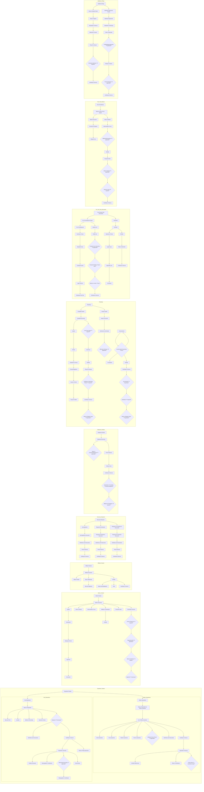

```mermaid

flowchart LR
    %% Deposition Packets
    subgraph Deposition_Packets
        direction TB
        A1[Deposition Packets]
        A1 --> B1[Written Depositions]
        A1 --> B2[Oral Depositions]

        %% Written Depositions Components
        subgraph Written_Depositions
            direction TB
            B1 --> C1[Notice of Deposition by Written Questions]
            C1 --> C2[List of Written Questions]
            C2 --> D1[Direct Questions]
            C2 --> D2[Cross Questions]
            C2 --> D3[Redirect Questions]
            C2 --> D4[Recross Questions]
            C2 --> C3{Subpoena Duces Tecum **if applicable**}
            C2 --> C4[Definitions and Instructions]
            C2 --> C5[Certificate of Service]
            C5 --> C6[Deposition Transcript]
            C6 --> D5[Exhibits Referenced]
            C6 --> D6[Officer's Certification]
            C6 --> D7{Errata Sheet **if corrections made**}
        end

        %% Oral Depositions Components
        subgraph Oral_Depositions
            direction TB
            B2 --> E1[Notice of Deposition]
            E1 --> F1[Date and Time]
            E1 --> F2[Location]
            E1 --> F3[Method of Recording]
            E1 --> F4[Deponent's Name]
            E1 --> E2{Subpoena **if necessary**}
            E2 --> E3[Definitions and Instructions]
            E2 --> E4[Certificate of Service]
            E4 --> E5[Deposition Transcript]
            E5 --> F5[Exhibits Introduced]
            E5 --> F6[Stenographer's Certification]
            E5 --> E6{Video/Audio Recording **if applicable**}
            E6 --> F7[Videographer's Certification]
            E5 --> F8[Errata Sheet]
            E4 --> E7[Notice of Filing Deposition]
        end
    end

    %% Motion Packets
    subgraph Motion_Packets
        direction TB
        G1[Motion Packets]
        G1 --> H1[Motion Document]
        H1 --> I1[Caption]
        I1 --> I2[Introduction]
        I2 --> I3[Background Facts]
        I3 --> I4[Argument]
        I4 --> I5[Conclusion]
        H1 --> H2[Notice of Motion]
        H1 --> H3[Memorandum of Law]
        H1 --> H4[Affidavit or Declaration]
        H4 --> I6[Exhibits]
        H1 --> H5[Proposed Order]
        H1 --> H6[Certificate of Service]
        H6 --> H7{Proof of Filing Fee **if required**}
        H7 --> H8{Supporting Brief **if applicable**}
        H8 --> H9{Table of Authorities **if lengthy**}
        H9 --> H10{Appendix **if necessary**}
    end

    %% Affidavit Packets
    subgraph Affidavit_Packets
        direction TB
        J1[Affidavit Packets]
        J1 --> K1[Affidavit Document]
        K1 --> L1[Affiant's Details]
        K1 --> L2[Sworn Statements]
        L2 --> L3[Date and Signature]
        K1 --> K2[Exhibits]
        K2 --> K3[Notary Acknowledgment]
        K2 --> K4[Jurat]
        K2 --> K5[Certificate of Service]
    end

    %% Discovery Requests
    subgraph Discovery_Requests
        direction TB
        M1[Discovery Requests]
        M1 --> N1[Interrogatories]
        N1 --> O1[Interrogatories Document]
        O1 --> O2[Definitions and Instructions]
        O2 --> O3[Proof of Service]
        O3 --> O4[Certificate of Service]
        M1 --> N2[Requests for Admission]
        N2 --> P1[Requests for Admission Document]
        P1 --> P2[Definitions and Instructions]
        P2 --> P3[Proof of Service]
        P3 --> P4[Certificate of Service]
        M1 --> N3[Requests for Production of Documents]
        N3 --> Q1[Requests for Production Document]
        Q1 --> Q2[Definitions and Instructions]
        Q2 --> Q3[Proof of Service]
        Q3 --> Q4[Certificate of Service]
    end

    %% Subpoena Packets
    subgraph Subpoena_Packets
        direction TB
        R1[Subpoena Packets]
        R1 --> S1[Subpoena Document]
        S1 --> S2{Notice to Consumer/Employee **if applicable**}
        S1 --> S3[Proof of Service]
        S3 --> S4[Witness Fees]
        S4 --> S5[Certificate of Service]
        S5 --> S6{Declaration of Custodian **if records subpoena**}
        S6 --> S7{Affidavit of Compliance **if required**}
    end

    %% Pleadings
    subgraph Pleadings
        direction TB
        T1[Pleadings]
        T1 --> U1[Complaint Packet]
        U1 --> V1[Complaint Document]
        V1 --> W1[Caption]
        W1 --> W2[Parties]
        W2 --> W3[Jurisdiction & Venue]
        W3 --> W4[Factual Allegations]
        W4 --> W5[Causes of Action]
        W5 --> W6[Prayer for Relief]
        V1 --> V2{Civil Cover Sheet **if required**}
        V2 --> V3[Summons]
        V3 --> V4[Exhibits]
        V4 --> V5[Filing Fee Receipt]
        V5 --> V6{Certificate of Interested Parties **if required**}
        V6 --> V7[Certificate of Service]
        V7 --> V8{Notice of Related Cases **if applicable**}
        T1 --> U2[Answer Packet]
        U2 --> X1[Answer Document]
        X1 --> Y1[Admissions and Denials]
        Y1 --> X2{Affirmative Defenses **if applicable**}
        Y2 --> X3{Counterclaims/Crossclaims **if any**}
        X3 --> Y2[Counterclaims]
        X3 --> Y3[Crossclaims]
        X3 --> X4[Exhibits]
        X4 --> X5[Certificate of Service]
        X5 --> X6{Jury Demand **if requesting**}
        X6 --> X7{Verification **if required**}
        X7 --> X8{Notice of Related Cases **if applicable**}
    end

    %% Pre-Trial and Trial Documents
    subgraph Pre_Trial_Trial_Documents
        Z1[Pre-Trial and Trial Documents]
        Z1 --> AA1[Pre-Trial Statement Packet]
        AA1 --> AB1[Pre-Trial Statement]
        AB1 --> AC1[Summary of Case]
        AC1 --> AC2[Stipulated Facts]
        AC2 --> AC3[Contested Issues]
        AC3 --> AC4[Legal Theories]
        AC4 --> AC5[Estimated Trial Time]
        AA1 --> AB2[Witness List]
        AB2 --> AB3[Exhibit List]
        AB3 --> AB4{Proposed Jury Instructions **if applicable**}
        AB4 --> AB5{Proposed Findings **bench trials**}
        AB5 --> AB6{Motions in Limine **if any**}
        AB6 --> AB7[Certificate of Service]
        Z1 --> AA2[Trial Briefs]
        AA2 --> AD1[Trial Brief]
        AD1 --> AE1[Statement of Facts]
        AE1 --> AE2[Legal Issues]
        AE2 --> AE3[Applicable Law]
        AE3 --> AE4[Conclusion]
        AD1 --> AD2[Exhibits]
        AD2 --> AD3[Table of Authorities]
        AD3 --> AD4[Certificate of Service]
    end

    %% Post-Trial Motions
    subgraph Post_Trial_Motions
        direction TB
        AF1[Post-Trial Motions]
        AF1 --> AG1[Motion for New Trial or Appeal]
        AG1 --> AH1[Motion Document]
        AH1 --> AI1[Grounds for Request]
        AI1 --> AI2[Alleged Errors]
        AG1 --> AH2[Notice of Motion]
        AH2 --> AH3[Memorandum of Law]
        AH3 --> AH4{Affidavits/Declarations **if applicable**}
        AH4 --> AJ1[Exhibits]
        AJ1 --> AH5[Proposed Order]
        AH5 --> AH6{Notice of Appeal **if appealing**}
        AH6 --> AH7{Bond for Costs **if required**}
        AH7 --> AH8[Certificate of Service]
    end

    %% Additional Filings
    subgraph Additional_Filings
        direction TB
        AK1[Additional Filings]
        AK1 --> AL1[Notice of Appeal Packet]
        AL1 --> AM1[Notice of Appeal]
        AM1 --> AM2[Designation of Record]
        AM2 --> AM3[Statement of Issues]
        AM3 --> AM4[Filing Fee Receipt]
        AM4 --> AM5{Docketing Statement **if required**}
        AM5 --> AM6[Certificate of Service]
        AK1 --> AL2[Settlement Agreement Packet]
        AL2 --> AN1[Settlement Agreement]
        AN1 --> AN2[Stipulation of Dismissal]
        AN2 --> AN3[Order of Dismissal]
        AN3 --> AN4{Confidentiality Agreement **if applicable**}
        AN4 --> AN5[Release of Claims]
        AN5 --> AN6{Proof of Payment **if applicable**}
        AN6 --> AN7[Certificate of Service]
    end


```