# Detailed Filing Packets and Their Components

Understanding the structure and required documents for various court filings is essential in legal proceedings. Below is a comprehensive and super-detailed list of different filing packets, their components, and Mermaid diagrams to illustrate their organization.

---

## Table of Contents

- [Detailed Filing Packets and Their Components](#detailed-filing-packets-and-their-components)
  - [Table of Contents](#table-of-contents)
  - [**1. Deposition Packets**](#1-deposition-packets)
    - [**A. Written Depositions**](#a-written-depositions)
      - [**Components:**](#components)
      - [**Enhanced Mermaid Diagram - Detailed and Optimized:**](#enhanced-mermaid-diagram---detailed-and-optimized)
          - [Enhanced Mermaid Diagram - Detailed and Optimized:](#enhanced-mermaid-diagram---detailed-and-optimized-1)
    - [2. Motion Packets](#2-motion-packets)
          - [Enhanced Mermaid Diagram - Detailed and Optimized:](#enhanced-mermaid-diagram---detailed-and-optimized-2)
    - [3. Affidavit Packets](#3-affidavit-packets)
          - [Enhanced Mermaid Diagram - Detailed and Optimized:](#enhanced-mermaid-diagram---detailed-and-optimized-3)
    - [4. Discovery Requests](#4-discovery-requests)
          - [Enhanced Mermaid Diagram - Detailed and Optimized:](#enhanced-mermaid-diagram---detailed-and-optimized-4)
          - [Enhanced Mermaid Diagram - Detailed and Optimized:](#enhanced-mermaid-diagram---detailed-and-optimized-5)
          - [Enhanced Mermaid Diagram - Detailed and Optimized:](#enhanced-mermaid-diagram---detailed-and-optimized-6)
    - [5. Subpoena Packets](#5-subpoena-packets)
          - [Enhanced Mermaid Diagram - Detailed and Optimized:](#enhanced-mermaid-diagram---detailed-and-optimized-7)
        - [A. Complaint Packet](#a-complaint-packet)
          - [Enhanced Mermaid Diagram - Detailed and Optimized:](#enhanced-mermaid-diagram---detailed-and-optimized-8)
        - [B. Answer Packet](#b-answer-packet)
          - [Enhanced Mermaid Diagram - Detailed and Optimized:](#enhanced-mermaid-diagram---detailed-and-optimized-9)
          - [Enhanced Mermaid Diagram - Detailed and Optimized:](#enhanced-mermaid-diagram---detailed-and-optimized-10)
          - [Enhanced Mermaid Diagram - Detailed and Optimized:](#enhanced-mermaid-diagram---detailed-and-optimized-11)
          - [Enhanced Mermaid Diagram - Detailed and Optimized:](#enhanced-mermaid-diagram---detailed-and-optimized-12)
          - [Enhanced Mermaid Diagram - Detailed and Optimized:](#enhanced-mermaid-diagram---detailed-and-optimized-13)
          - [Enhanced Mermaid Diagram - Detailed and Optimized:](#enhanced-mermaid-diagram---detailed-and-optimized-14)
        - [Impact on Packet Compilation:](#impact-on-packet-compilation)
        - [Court Requirements:](#court-requirements)
        - [Importance:](#importance)
        - [Court Rules:](#court-rules)
        - [Timeliness:](#timeliness)
        - [Redaction Requirements:](#redaction-requirements)
        - [Translation:](#translation)

---

## **1. Deposition Packets**

### **A. Written Depositions**

A written deposition involves submitting written questions to a deponent, who responds under oath in writing.

#### **Components:**

1. **Notice of Deposition by Written Questions**
   - Specifies the deponent, time frame, and any document requests.
2. **List of Written Questions**
   - Organized into:
     - Direct Questions
     - Cross Questions
     - Redirect Questions
     - Recross Questions
3. **Subpoena Duces Tecum** *(if requesting documents)*
   - Commands the deponent to produce specified documents.
4. **Definitions and Instructions**
   - Clarifies terms used and provides guidance on answering.
5. **Certificate of Service**
   - Proof of serving all parties.
6. **Deposition Transcript**
   - The deponent's sworn written responses.
7. **Exhibits Referenced**
   - Documents or evidence the deponent refers to.
8. **Officer's Certification**
   - Statement by the notary or authorized officer.
9. **Errata Sheet** *(if corrections are made)*
   - Deponent's corrections to the transcript.

#### **Enhanced Mermaid Diagram - Detailed and Optimized:**

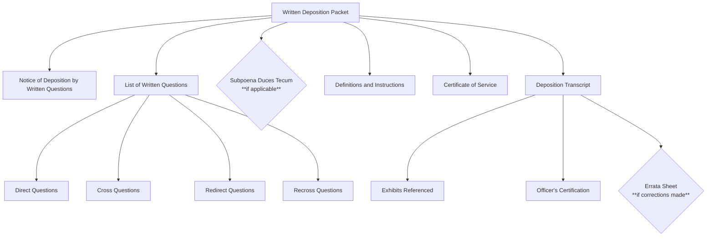
B. Oral Depositions (Video or Written Transcript)
An oral deposition involves a deponent answering questions verbally under oath.

Components:
- [ ] Notice of Deposition
- [ ] Includes:
- [ ] Date and Time
- [ ] Location
- [ ] Method of Recording (stenographic, video, audio)
- [ ] Deponent's Name
- [ ] Subpoena (if necessary)
- [ ] Compels attendance or document production.
- [ ] Definitions and Instructions
- [ ] Provides context and guidance.
- [ ] Certificate of Service
- [ ] Proof of serving all parties.
- [ ] Deposition Transcript
- [ ] Written record of testimony.
- [ ] Video or Audio Recording (if applicable)
- [ ] Actual recording of the deposition.
- [ ] Exhibits Introduced
- [ ] Physical or digital copies presented during deposition.
- [ ] Stenographer's Certification
- [ ] Verifies transcript accuracy.
- [ ] Videographer's Certification (for video depositions)
- [ ] Affirms recording is accurate.
- [ ] Errata Sheet
- [ ] Deponent's corrections to the transcript.
- [ ] Notice of Filing Deposition Transcript/Recording
- [ ] Informs parties and court that the deposition is filed.

###### Enhanced Mermaid Diagram - Detailed and Optimized:
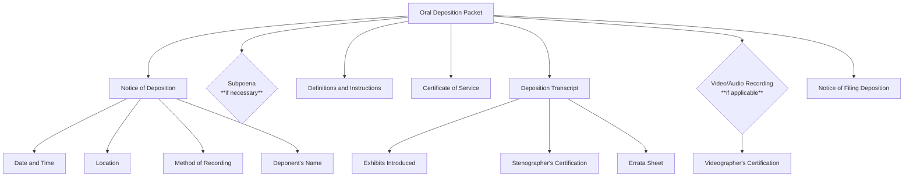
### 2. Motion Packets
A motion is a formal request asking the court to make a specific ruling or order.

Components:
- [ ] Motion Document
- [ ] Caption with court details.
- [ ] Introduction stating relief sought.
- [ ] Background facts.
- [ ] Argument section with legal basis.
- [ ] Conclusion and prayer for relief.
- [ ] Notice of Motion
- [ ] Date, time, and location of the hearing.
- [ ] Memorandum of Law
- [ ] Detailed legal arguments and citations.
- [ ] Affidavit or Declaration
- [ ] Sworn statements with factual support.
- [ ] Exhibits
- [ ] Evidence supporting the motion (e.g., contracts, emails).
- [ ] Proposed Order
- [ ] Draft order for the judge to sign.
- [ ] Certificate of Service
- [ ] Proof of serving all documents.
- [ ] Proof of Filing Fee Payment (if required)
- [ ] Supporting Brief (if applicable)
- [ ] Additional legal arguments.
- [ ] Table of Authorities (for lengthy motions)
- [ ] List of legal citations used.
- [ ] Appendix (if necessary)
- [ ] Additional supporting documents.

###### Enhanced Mermaid Diagram - Detailed and Optimized:
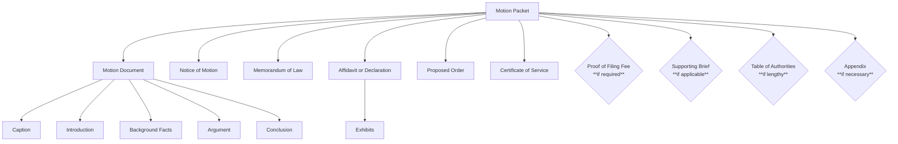
### 3. Affidavit Packets
An affidavit is a written statement confirmed by oath or affirmation.

Components:
- [ ] Affidavit Document
- [ ] Personal details of the affiant.
- [ ] Sworn statements of fact.
- [ ] Date and signature.
- [ ] Exhibits
- [ ] Documents referenced in the affidavit.
- [ ] Notary Public Acknowledgment
- [ ] Notarization confirming affiant's identity.
- [ ] Jurat
- [ ] Clause stating when, where, and before whom it was sworn.
- [ ] Certificate of Service
- [ ] Proof of serving all parties.

###### Enhanced Mermaid Diagram - Detailed and Optimized:
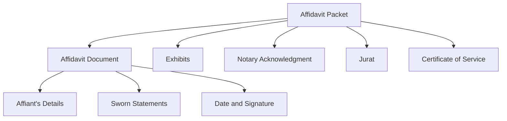
### 4. Discovery Requests
A. Interrogatories
Written questions that one party sends to another to be answered under oath.

Components:
- [ ] Interrogatories Document
- [ ] Numbered list of questions.
- [ ] Definitions and Instructions
- [ ] Clarifies terms and provides response guidelines.
- [ ] Proof of Service
- [ ] Verification of proper service.
- [ ] Certificate of Service

###### Enhanced Mermaid Diagram - Detailed and Optimized:
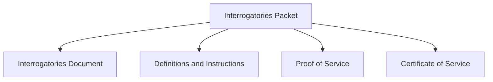
B. Requests for Admission
Requests that the other party admit or deny specific statements.

Components:
- [ ] Requests for Admission Document
- [ ] Numbered statements for admission or denial.
- [ ] Definitions and Instructions
- [ ] Proof of Service
- [ ] Certificate of Service

###### Enhanced Mermaid Diagram - Detailed and Optimized:
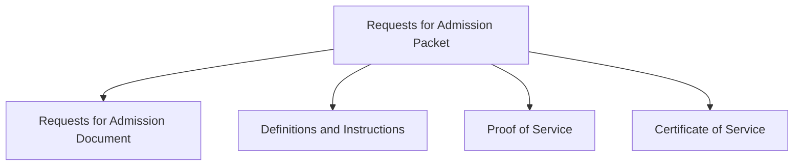
C. Requests for Production of Documents
Requests for the other party to produce specified documents.

Components:
- [ ] Requests for Production Document
- [ ] Numbered list of document requests.
- [ ] Definitions and Instructions
- [ ] Proof of Service
- [ ] Certificate of Service

###### Enhanced Mermaid Diagram - Detailed and Optimized:

### 5. Subpoena Packets
A subpoena compels a person to testify or produce evidence.

Components:
- [ ] Subpoena Document
- [ ] Specifies testimony or documents required.
- [ ] Notice to Consumer or Employee (if applicable)
- [ ] Required when seeking personal records.
- [ ] Proof of Service
- [ ] Verification of proper service.
- [ ] Witness Fees
- [ ] Payment or proof of payment.
- [ ] Certificate of Service
- [ ] Declaration of Custodian of Records (for records subpoenas)
- [ ] Authenticates records produced.
- [ ] Affidavit of Compliance (if required by jurisdiction)

###### Enhanced Mermaid Diagram - Detailed and Optimized:
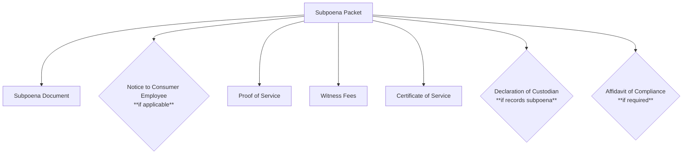
1. Pleadings
##### A. Complaint Packet
Initiates a lawsuit by outlining the plaintiff's claims.

Components:
- [ ] Complaint Document
- [ ] Caption with court details.
- [ ] Parties involved.
- [ ] Jurisdiction and venue statements.
- [ ] Factual allegations.
- [ ] Causes of action.
- [ ] Prayer for relief.
- [ ] Civil Cover Sheet (in federal courts)
- [ ] Provides basic case information.
- [ ] Summons
- [ ] Official notice to the defendant.
- [ ] Exhibits
- [ ] Supporting documents (e.g., contracts, correspondence).
- [ ] Filing Fee Receipt
- [ ] Proof of payment of court filing fees.
- [ ] Certificate of Interested Parties (if required)
- [ ] Discloses any entities with a financial interest.
- [ ] Certificate of Service
- [ ] Notice of Related Cases (if applicable)

###### Enhanced Mermaid Diagram - Detailed and Optimized:
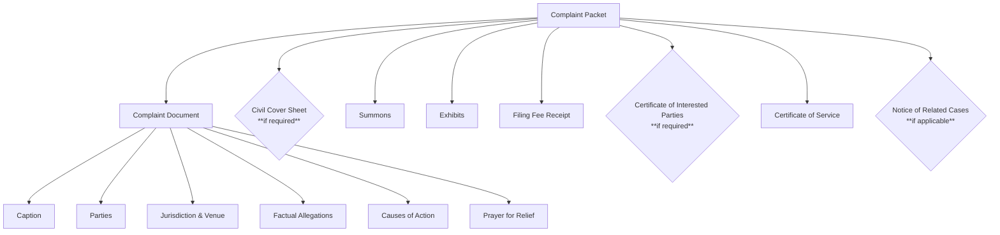
##### B. Answer Packet
The defendant's formal response to the complaint.

Components:
- [ ] Answer Document
- [ ] Admissions and denials of allegations.
- [ ] Responses to each numbered paragraph of the complaint.
- [ ] Affirmative Defenses
- [ ] Legal reasons negating liability.
- [ ] Counterclaims or Crossclaims (if any)
- [ ] Claims against the plaintiff or other defendants.
- [ ] Exhibits
- [ ] Supporting documents.
- [ ] Certificate of Service
- [ ] Jury Demand (if requesting a jury trial)
- [ ] Verification (if required)
- [ ] Sworn statement confirming the truthfulness of the answer.
- [ ] Notice of Related Cases (if applicable)

###### Enhanced Mermaid Diagram - Detailed and Optimized:
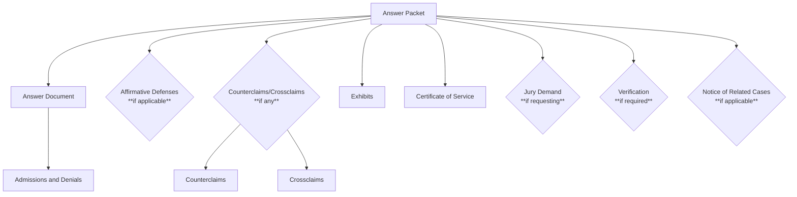
7. Pre-Trial and Trial Documents
A. Pre-Trial Statement Packet
Summarizes each party's position and evidence before trial.

Components:
- [ ] Pre-Trial Statement
- [ ] Summary of case.
- [ ] Stipulated facts.
- [ ] Contested issues of fact and law.
- [ ] Legal theories.
- [ ] Estimated trial time.
- [ ] Witness List
- [ ] Names, contact information, and summaries of expected testimony.
- [ ] Exhibit List
- [ ] List of all exhibits intended to be introduced.
- [ ] Proposed Jury Instructions (if applicable)
- [ ] Suggested legal standards for jury consideration.
- [ ] Proposed Findings of Fact and Conclusions of Law (in bench trials)
- [ ] Motions in Limine (if any)
- [ ] Pre-trial motions to exclude certain evidence.
- [ ] Certificate of Service

###### Enhanced Mermaid Diagram - Detailed and Optimized:
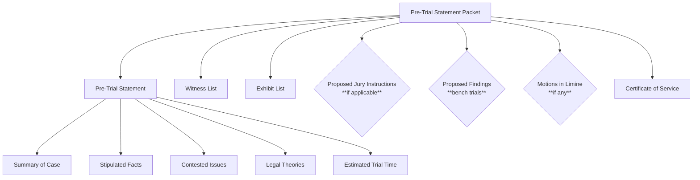
B. Trial Briefs
Legal arguments and case law supporting a party's position during trial.

Components:
- [ ] Trial Brief
- [ ] Statement of facts.
- [ ] Legal issues to be addressed.
- [ ] Applicable law and analysis.
- [ ] Conclusion.
- [ ] Exhibits
- [ ] Additional evidence or case law excerpts.
- [ ] Table of Authorities
- [ ] List of legal citations used.
- [ ] Certificate of Service

###### Enhanced Mermaid Diagram - Detailed and Optimized:
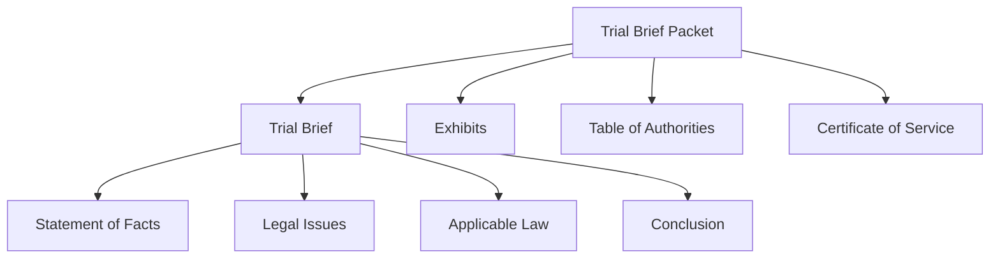
8. Post-Trial Motions
A. Motion for New Trial or Appeal
Requests the court to reconsider or appeal a decision.

Components:
- [ ] Motion Document
- [ ] Grounds for the request.
- [ ] Specific errors alleged.
- [ ] Notice of Motion
- [ ] Hearing details.
- [ ] Memorandum of Law
- [ ] Legal arguments and citations.
- [ ] Affidavits or Declarations
- [ ] New evidence or statements.
- [ ] Exhibits
- [ ] Supporting documents.
- [ ] Proposed Order
- [ ] Draft for the court's consideration.
- [ ] Notice of Appeal (if appealing)
- [ ] Bond for Costs on Appeal (if required)
- [ ] Certificate of Service

###### Enhanced Mermaid Diagram - Detailed and Optimized:
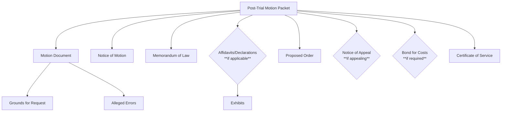
9. Additional Filings
A. Notice of Appeal Packet
Initiates the appeal process.

Components:
- [ ] Notice of Appeal
- [ ] Identifies the judgment or order being appealed.
- [ ] Designation of Record on Appeal
- [ ] Specifies which documents and transcripts to include.
- [ ] Statement of Issues on Appeal
- [ ] Lists the legal issues for appellate review.
- [ ] Filing Fee Receipt
- [ ] Proof of payment of appellate filing fees.
- [ ] Docketing Statement (if required)
- [ ] Provides case information for the appellate court.
- [ ] Certificate of Service

###### Enhanced Mermaid Diagram - Detailed and Optimized:
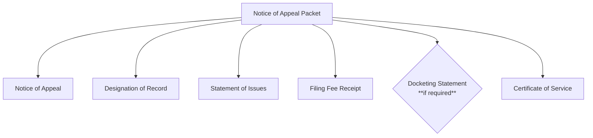
B. Settlement Agreement Packet
Documents the agreement between parties to settle the case.

Components:
- [ ] Settlement Agreement
- [ ] Terms and conditions of the settlement.
- [ ] Stipulation of Dismissal
- [ ] Joint request to dismiss the case.
- [ ] Order of Dismissal
- [ ] Proposed order for the court.
- [ ] Confidentiality Agreement (if applicable)
- [ ] Release of Claims
- [ ] Plaintiff releases defendant from further liability.
- [ ] Proof of Payment (if settlement involves payment)
- [ ] Certificate of Service

###### Enhanced Mermaid Diagram - Detailed and Optimized:
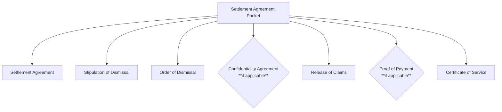
10. Background on Filing Packets and Theory
Organization and Compliance
* Efficiency: Grouping documents ensures all necessary components are included, streamlining court processing.
* Compliance: Adheres to court rules regarding formatting and procedures.
* Clarity: Enhances understanding for the court and opposing parties.
* Professionalism: Reflects attention to detail and respect for court protocols.
* Naming Conventions
* "Packet" or "Set": Refers to a collection of related documents filed together.
* Standardization: Use of templates and checklists promotes consistency.
* Indexing: Proper labeling (e.g., Exhibit A, Exhibit B) aids in reference.
* Legal Theory
* Due Process: Proper filings uphold the right to fair notice and an opportunity to respond.
* Record Keeping: Creates an accurate court record, crucial for appeals.
* Advocacy: Strengthens legal arguments through clear and organized presentation.
* Transparency: Facilitates open and fair legal proceedings.

11. Additional Considerations
Electronic Filing (E-Filing):

##### Impact on Packet Compilation:
May require separate PDFs or specific formatting.
Use of electronic signatures where permitted.
Compliance with e-filing technical requirements.
Formatting Rules:

##### Court Requirements:
Font size (typically 12-point Times New Roman).
Margins (usually one inch on all sides).
Page limits.
Proper citation styles (e.g., Bluebook).
Service of Process:

##### Importance:
Proper service is essential to avoid delays or dismissals.
Methods vary (personal service, mail, electronic).
Proof of service documents are critical.
Local Variations:

##### Court Rules:
Always consult specific jurisdictional rules and procedures.
Some courts have unique forms or additional requirements.
Deadlines:

##### Timeliness:
Filing and serving documents within prescribed time frames.
Calendaring deadlines to ensure compliance.
Confidential Information:

##### Redaction Requirements:
Personal identifiers (e.g., Social Security numbers) may need to be redacted.
Compliance with privacy laws.
Language Accessibility:

##### Translation:
Documents may need to be translated for parties with limited English proficiency.
Certified translations might be required.
12. Conclusion
Organizing legal documents into well-structured packets is essential for effective court submissions. Each filing type has specific requirements, and meticulous attention to detail ensures compliance with court rules and enhances the clarity of your presentation. Always refer to the specific rules of the court handling your case and consider seeking guidance from legal professionals.

13. Comprehensive Enhanced Mermaid Diagram - Detailed and Optimized
Below is a comprehensive Mermaid diagram that includes all filing packets and their components, ordered by their first appearance in this document.

```mermaid
flowchart LR
    %% Deposition Packets
    subgraph Deposition_Packets
        direction TB
        A1[Deposition Packets]
        A1 --> B1[Written Depositions]
        A1 --> B2[Oral Depositions]

        %% Written Depositions Components
        subgraph Written_Depositions
            direction TB
            B1 --> C1[Notice of Deposition by Written Questions]
            C1 --> C2[List of Written Questions]
            C2 --> D1[Direct Questions]
            C2 --> D2[Cross Questions]
            C2 --> D3[Redirect Questions]
            C2 --> D4[Recross Questions]
            C2 --> C3{Subpoena Duces Tecum **if applicable**}
            C2 --> C4[Definitions and Instructions]
            C2 --> C5[Certificate of Service]
            C5 --> C6[Deposition Transcript]
            C6 --> D5[Exhibits Referenced]
            C6 --> D6[Officer's Certification]
            C6 --> D7{Errata Sheet **if corrections made**}
        end

        %% Oral Depositions Components
        subgraph Oral_Depositions
            direction TB
            B2 --> E1[Notice of Deposition]
            E1 --> F1[Date and Time]
            E1 --> F2[Location]
            E1 --> F3[Method of Recording]
            E1 --> F4[Deponent's Name]
            E1 --> E2{Subpoena **if necessary**}
            E2 --> E3[Definitions and Instructions]
            E2 --> E4[Certificate of Service]
            E4 --> E5[Deposition Transcript]
            E5 --> F5[Exhibits Introduced]
            E5 --> F6[Stenographer's Certification]
            E5 --> E6{Video/Audio Recording **if applicable**}
            E6 --> F7[Videographer's Certification]
            E5 --> F8[Errata Sheet]
            E4 --> E7[Notice of Filing Deposition]
        end
    end

    %% Motion Packets
    subgraph Motion_Packets
        direction TB
        G1[Motion Packets]
        G1 --> H1[Motion Document]
        H1 --> I1[Caption]
        I1 --> I2[Introduction]
        I2 --> I3[Background Facts]
        I3 --> I4[Argument]
        I4 --> I5[Conclusion]
        H1 --> H2[Notice of Motion]
        H1 --> H3[Memorandum of Law]
        H1 --> H4[Affidavit or Declaration]
        H4 --> I6[Exhibits]
        H1 --> H5[Proposed Order]
        H1 --> H6[Certificate of Service]
        H6 --> H7{Proof of Filing Fee **if required**}
        H7 --> H8{Supporting Brief **if applicable**}
        H8 --> H9{Table of Authorities **if lengthy**}
        H9 --> H10{Appendix **if necessary**}
    end

    %% Affidavit Packets
    subgraph Affidavit_Packets
        direction TB
        J1[Affidavit Packets]
        J1 --> K1[Affidavit Document]
        K1 --> L1[Affiant's Details]
        K1 --> L2[Sworn Statements]
        L2 --> L3[Date and Signature]
        K1 --> K2[Exhibits]
        K2 --> K3[Notary Acknowledgment]
        K2 --> K4[Jurat]
        K2 --> K5[Certificate of Service]
    end

    %% Discovery Requests
    subgraph Discovery_Requests
        direction TB
        M1[Discovery Requests]
        M1 --> N1[Interrogatories]
        N1 --> O1[Interrogatories Document]
        O1 --> O2[Definitions and Instructions]
        O2 --> O3[Proof of Service]
        O3 --> O4[Certificate of Service]
        M1 --> N2[Requests for Admission]
        N2 --> P1[Requests for Admission Document]
        P1 --> P2[Definitions and Instructions]
        P2 --> P3[Proof of Service]
        P3 --> P4[Certificate of Service]
        M1 --> N3[Requests for Production of Documents]
        N3 --> Q1[Requests for Production Document]
        Q1 --> Q2[Definitions and Instructions]
        Q2 --> Q3[Proof of Service]
        Q3 --> Q4[Certificate of Service]
    end

    %% Subpoena Packets
    subgraph Subpoena_Packets
        direction TB
        R1[Subpoena Packets]
        R1 --> S1[Subpoena Document]
        S1 --> S2{Notice to Consumer/Employee **if applicable**}
        S1 --> S3[Proof of Service]
        S3 --> S4[Witness Fees]
        S4 --> S5[Certificate of Service]
        S5 --> S6{Declaration of Custodian **if records subpoena**}
        S6 --> S7{Affidavit of Compliance **if required**}
    end

    %% Pleadings
    subgraph Pleadings
        direction TB
        T1[Pleadings]
        T1 --> U1[Complaint Packet]
        U1 --> V1[Complaint Document]
        V1 --> W1[Caption]
        W1 --> W2[Parties]
        W2 --> W3[Jurisdiction & Venue]
        W3 --> W4[Factual Allegations]
        W4 --> W5[Causes of Action]
        W5 --> W6[Prayer for Relief]
        V1 --> V2{Civil Cover Sheet **if required**}
        V2 --> V3[Summons]
        V3 --> V4[Exhibits]
        V4 --> V5[Filing Fee Receipt]
        V5 --> V6{Certificate of Interested Parties **if required**}
        V6 --> V7[Certificate of Service]
        V7 --> V8{Notice of Related Cases **if applicable**}
        T1 --> U2[Answer Packet]
        U2 --> X1[Answer Document]
        X1 --> Y1[Admissions and Denials]
        Y1 --> X2{Affirmative Defenses **if applicable**}
        Y2 --> X3{Counterclaims/Crossclaims **if any**}
        X3 --> Y2[Counterclaims]
        X3 --> Y3[Crossclaims]
        X3 --> X4[Exhibits]
        X4 --> X5[Certificate of Service]
        X5 --> X6{Jury Demand **if requesting**}
        X6 --> X7{Verification **if required**}
        X7 --> X8{Notice of Related Cases **if applicable**}
    end

    %% Pre-Trial and Trial Documents
    subgraph Pre_Trial_Trial_Documents
        Z1[Pre-Trial and Trial Documents]
        Z1 --> AA1[Pre-Trial Statement Packet]
        AA1 --> AB1[Pre-Trial Statement]
        AB1 --> AC1[Summary of Case]
        AC1 --> AC2[Stipulated Facts]
        AC2 --> AC3[Contested Issues]
        AC3 --> AC4[Legal Theories]
        AC4 --> AC5[Estimated Trial Time]
        AA1 --> AB2[Witness List]
        AB2 --> AB3[Exhibit List]
        AB3 --> AB4{Proposed Jury Instructions **if applicable**}
        AB4 --> AB5{Proposed Findings **bench trials**}
        AB5 --> AB6{Motions in Limine **if any**}
        AB6 --> AB7[Certificate of Service]
        Z1 --> AA2[Trial Briefs]
        AA2 --> AD1[Trial Brief]
        AD1 --> AE1[Statement of Facts]
        AE1 --> AE2[Legal Issues]
        AE2 --> AE3[Applicable Law]
        AE3 --> AE4[Conclusion]
        AD1 --> AD2[Exhibits]
        AD2 --> AD3[Table of Authorities]
        AD3 --> AD4[Certificate of Service]
    end

    %% Post-Trial Motions
    subgraph Post_Trial_Motions
        direction TB
        AF1[Post-Trial Motions]
        AF1 --> AG1[Motion for New Trial or Appeal]
        AG1 --> AH1[Motion Document]
        AH1 --> AI1[Grounds for Request]
        AI1 --> AI2[Alleged Errors]
        AG1 --> AH2[Notice of Motion]
        AH2 --> AH3[Memorandum of Law]
        AH3 --> AH4{Affidavits/Declarations **if applicable**}
        AH4 --> AJ1[Exhibits]
        AJ1 --> AH5[Proposed Order]
        AH5 --> AH6{Notice of Appeal **if appealing**}
        AH6 --> AH7{Bond for Costs **if required**}
        AH7 --> AH8[Certificate of Service]
    end

    %% Additional Filings
    subgraph Additional_Filings
        direction TB
        AK1[Additional Filings]
        AK1 --> AL1[Notice of Appeal Packet]
        AL1 --> AM1[Notice of Appeal]
        AM1 --> AM2[Designation of Record]
        AM2 --> AM3[Statement of Issues]
        AM3 --> AM4[Filing Fee Receipt]
        AM4 --> AM5{Docketing Statement **if required**}
        AM5 --> AM6[Certificate of Service]
        AK1 --> AL2[Settlement Agreement Packet]
        AL2 --> AN1[Settlement Agreement]
        AN1 --> AN2[Stipulation of Dismissal]
        AN2 --> AN3[Order of Dismissal]
        AN3 --> AN4{Confidentiality Agreement **if applicable**}
        AN4 --> AN5[Release of Claims]
        AN5 --> AN6{Proof of Payment **if applicable**}
        AN6 --> AN7[Certificate of Service]
    end

```
You can copy and paste this markdown code into your own file to view and edit it as needed. The Mermaid diagrams will render properly when viewed in a Markdown viewer or editor that supports Mermaid syntax.