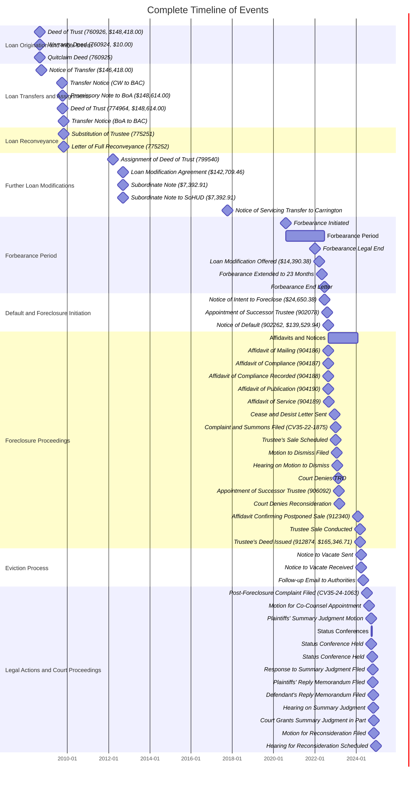

```mermaid
gantt
    title Complete Timeline of Events
    dateFormat  YYYY-MM-DD
    axisFormat  %Y-%m

    section Loan Origination and Initial Deeds
    Deed of Trust (760926, $148,418.00)          :milestone, 2008-09-04, 0d
    Warranty Deed (760924, $10.00)               :milestone, 2008-09-05, 0d
    Quitclaim Deed (760925)                      :milestone, 2008-09-05, 0d

    section Loan Transfers and Assignments
    Notice of Transfer ($146,418.00)             :milestone, 2008-10-01, 0d
    Transfer Notice (CW to BAC)                  :milestone, 2009-10-01, 0d
    Promissory Note to BoA ($148,614.00)         :milestone, 2009-10-16, 0d
    Deed of Trust (774964, $148,614.00)          :milestone, 2009-10-16, 0d
    Transfer Notice (BoA to BAC)                 :milestone, 2009-10-30, 0d

    section Loan Reconveyance
    Substitution of Trustee (775251)             :milestone, 2009-11-02, 0d
    Letter of Full Reconveyance (775252)         :milestone, 2009-11-02, 0d

    section Further Loan Modifications
    Assignment of Deed of Trust (799540)         :milestone, 2012-03-20, 0d
    Loan Modification Agreement ($142,709.46)    :milestone, 2012-09-14, 0d
    Subordinate Note ($7,392.91)                 :milestone, 2012-09-14, 0d
    Subordinate Note to SoHUD ($7,392.91)        :milestone, 2012-09-14, 0d
    Notice of Servicing Transfer to Carrington   :milestone, 2017-10-07, 0d

    section Forbearance Period
    Forbearance Initiated                        :milestone, 2020-07-31, 0d
    Forbearance Period                           :2020-07-31, 2022-06-18
    Forbearance Legal End                        :milestone, 2022-01-01, 0d
    Loan Modification Offered ($14,390.38)       :milestone, 2022-03-15, 0d
    Forbearance Extended to 23 Months            :milestone, 2022-04-26, 0d
    Forbearance End Letter                       :milestone, 2022-06-18, 0d

    section Default and Foreclosure Initiation
    Notice of Intent to Foreclose ($24,650.38)   :milestone, 2022-06-18, 0d
    Appointment of Successor Trustee (902078)    :milestone, 2022-08-02, 0d
    Notice of Default (902262, $139,529.94)      :milestone, 2022-08-17, 0d

    section Foreclosure Proceedings
    Affidavits and Notices                       :2022-08-17, 2024-01-29
    Affidavit of Mailing (904186)                :milestone, 2022-08-17, 0d
    Affidavit of Compliance (904187)             :milestone, 2022-08-19, 0d
    Affidavit of Compliance Recorded (904188)    :milestone, 2022-08-23, 0d
    Affidavit of Publication (904190)            :milestone, 2022-08-24, 0d
    Affidavit of Service (904189)                :milestone, 2022-08-31, 0d
    Cease and Desist Letter Sent                 :milestone, 2022-12-12, 0d
    Complaint and Summons Filed (CV35-22-1875)   :milestone, 2022-12-27, 0d
    Trustee's Sale Scheduled                     :milestone, 2022-12-30, 0d
    Motion to Dismiss Filed                      :milestone, 2023-01-17, 0d
    Hearing on Motion to Dismiss                 :milestone, 2023-01-26, 0d
    Court Denies TRO                             :milestone, 2023-02-17, 0d
    Appointment of Successor Trustee (906092)    :milestone, 2023-02-23, 0d
    Court Denies Reconsideration                 :milestone, 2023-03-09, 0d
    Affidavit Confirming Postponed Sale (912340) :milestone, 2024-01-29, 0d
    Trustee Sale Conducted                       :milestone, 2024-02-29, 0d
    Trustee's Deed Issued (912874, $165,346.71)  :milestone, 2024-03-01, 0d

    section Eviction Process
    Notice to Vacate Sent                        :milestone, 2024-03-21, 0d
    Notice to Vacate Received                    :milestone, 2024-03-25, 0d
    Follow-up Email to Authorities               :milestone, 2024-05-02, 0d

    section Legal Actions and Court Proceedings
    Post-Foreclosure Complaint Filed (CV35-24-1063) :milestone, 2024-07-08, 0d
    Motion for Co-Counsel Appointment            :milestone, 2024-08-13, 0d
    Plaintiffs' Summary Judgment Motion          :milestone, 2024-09-16, 0d
    Status Conferences                           :2024-09-17, 2024-10-08
    Status Conference Held                       :milestone, 2024-09-17, 0d
    Status Conference Held                       :milestone, 2024-10-08, 0d
    Response to Summary Judgment Filed           :milestone, 2024-10-15, 0d
    Plaintiffs' Reply Memorandum Filed           :milestone, 2024-10-18, 0d
    Defendant's Reply Memorandum Filed           :milestone, 2024-10-21, 0d
    Hearing on Summary Judgment                  :milestone, 2024-10-22, 0d
    Court Grants Summary Judgment in Part        :milestone, 2024-11-05, 0d
    Motion for Reconsideration Filed             :milestone, 2024-11-06, 0d
    Hearing for Reconsideration Scheduled        :milestone, 2024-12-10, 0d


```