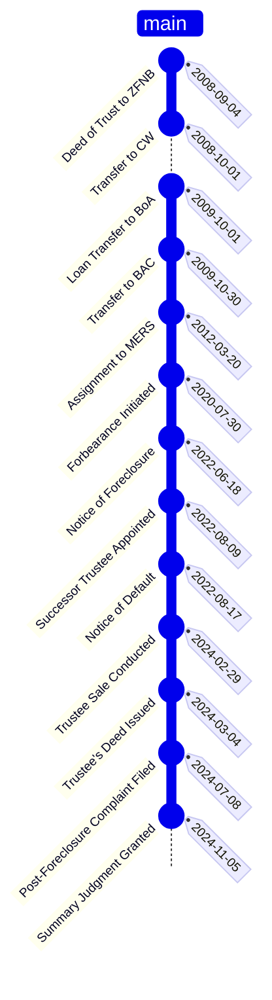

```mermaid
gitGraph TB:
    commit id: "Deed of Trust to ZFNB" tag: "2008-09-04"
    commit id: "Transfer to CW" tag: "2008-10-01"
    commit id: "Transfer to BAC" tag: "2008-10-01"
    commit id: "Loan Transfer to BoA" tag: "2009-10-01"
    commit id: "Transfer to BAC" tag: "2009-10-30"
    commit id: "Assignment to MERS" tag: "2012-03-20"
    commit id: "Forbearance Initiated" tag: "2020-07-30"
    commit id: "Notice of Foreclosure" tag: "2022-06-18"
    commit id: "Successor Trustee Appointed" tag: "2022-08-09"
    commit id: "Notice of Default" tag: "2022-08-17"
    commit id: "Trustee Sale Conducted" tag: "2024-02-29"
    commit id: "Trustee's Deed Issued" tag: "2024-03-04"
    commit id: "Post-Foreclosure Complaint Filed" tag: "2024-07-08"
    commit id: "Summary Judgment Granted" tag: "2024-11-05"

```