```folder-overview
id: dcc89ed9-5546-401c-a092-2b006bda3753
folderPath: ""
title: "{{folderName}} overview"
showTitle: true
depth: 4
style: list
includeTypes:
  - folder
  - all
disableFileTag: true
sortBy: name
sortByAsc: true
showEmptyFolders: false
onlyIncludeSubfolders: false
storeFolderCondition: true
showFolderNotes: true
disableCollapseIcon: true
```


# Exhibit T: Deed of Trust (Instrument 774964)

---

## Summary

### Document Title
**Deed of Trust**

### Jurisdiction Details
- **Property Location**: [[LEWISTON]], [[NEZ PERCE COUNTY]], [[IDAHO]]
- **Recording Entity**: [[NEZ PERCE COUNTY]] Recorder's Office
- **Instrument Number**: 774964
- **Recording Date**: October 30, 2009
- **Notarization Date**: **October 23, 2009**
- **Jurisdiction of Notarization**: [[STATE OF IDAHO]], [[NEZ PERCE COUNTY]]

---

## Key Parties Involved

### Borrower
- **Name**: [[BASS, JEREMY L|JEREMY L. BASS]]
  - **Role**: A married man dealing with his sole and separate property.
  - **Address**: [[1515 21ST AVE, LEWISTON, ID 83501]]

### Trustee
- **Name**: [[FIDELITY NATIONAL TITLE INSURANCE CO.]]
  - **Address**: [[P.O. BOX 32695, PHOENIX, AZ 85064]]

### Beneficiary
- **Name**: [[MORTGAGE ELECTRONIC REGISTRATION SYSTEMS, INC.|MERS]]
  - **Role**: Nominee for [[BANK OF AMERICA, N.A.|BoA]], holding legal title to the loan interest.
  - **Address**: [[P.O. BOX 2026, FLINT, MI 48501-2026]]

### Lender
- **Name**: [[BANK OF AMERICA, N.A.|BoA]]
  - **Address**: [[101 SOUTH TRYON STREET, CHARLOTTE, NC 28255]]

### Title Agent
- **Name**: [[ALLIANCE TITLE]]

### Prepared By
- **Name**: [[WILLIAMS, ELIZABETH|ELIZABETH WILLIAMS]]

### Notary Public
- **Name**: [[BINGMAN, SUSANNE|SUSANNE BINGMAN]]
  - **Role**: Verified the execution of the deed of trust.
  - **Jurisdiction**: [[STATE OF IDAHO]]
  - **Residing In**: [[CLARKSTON, WA]]

### Recording Officer
- **Name**: [[WEEKS, PATTY O|PATTY O. WEEKS]]
  - **Role**: Recorder for [[NEZ PERCE COUNTY]], ID.
  - **Deputy Recorder**: [[LANO TITLE]]

---

## Document Highlights

### What For
To secure the repayment of the borrower's loan by granting a lien against the property to the lender, with MERS acting as the beneficiary.

### Why
To secure a loan of **$148,614.00**, with a maturity date of **November 1, 2039**, evidenced by a promissory note.

### Property Details
- **Legal Description**:
  - The East 25 feet of Lot 9 and all of Lot 10, Block 10, MAPLEWOOD ADDITION to the City of Lewiston, Nez Perce County, State of Idaho, according to the recorded plat thereof.
- **Parcel ID Number**: [[RPL0880010010AA]]
- **Property Address**: [[1515 21ST AVE, LEWISTON, ID 83501]]

---


🎉⚖️⛓️‍💥🩻📠📑📜🗞️📚💸🪙✒️🗳️🗃️🧭🗺️🏛️👁️‍🗨️
🕋⛪🏙️🏢🏣🏦🏥🏤🏪🏬🏭♻️🛅🔃🔙💭🗯️💬🗨️
🤜🤛👩‍⚖️😵‍💫🤑😱🥵🥴🤮🫨🫣🫢☠️💀🙈🙉🙊🐵🗣️

```mermaid
%%{init: { 'theme': 'base', 'themeVariables': { 'git2': '#ff0000' } } }%%
%%{init: { 'theme': 'base', 'gitGraph': {'showBranches': true, 'showCommitLabel': true, 'mainBranchName': 'Normal Chain', 'parallelCommits': true}} }%%
gitGraph TB:
    commit id: "📝WD (2008-09-05)" tag: "IN: 760924"
    commit id: "📝QD (2008-09-05)" tag: "IN: 760925"
    commit id: "💸📜DOT1 (2008-09-08)" tag: "IN: 760926" type: HIGHLIGHT
    commit id: "🔄 ZFNB->CW (2008-10-01)" tag: "Exhibit AL"
    commit id: "🔄 CW->BAC (2009-10-01)" tag: "Exhibit AO"

    branch "Defect Title"
    commit id: "💸📑🖍️ FORGED (2009-10-16)" tag: "IN: 774964"
    branch "LOAN DOUBLING"
    commit id: "💸(2009-10-16)" tag: "from 148614.00 -> 297228"
    checkout "Defect Title"
    commit id: "📑🗳️NOTARIZED (2009-10-23)"

    checkout "Normal Chain"
    commit id: "🔄 BoA->BAC Created (2009-10-26)" tag: "Exhibit AP"
    commit id: "🔄 BoA->BAC Noticed (2009-10-30)" tag: "Exhibit AQ"

    checkout "Defect Title"
    commit id: "📑🗃️ RECORDED (2009-10-30)" tag: "IN: 774964" type: HIGHLIGHT

    checkout "Normal Chain"
    commit id: "🔄 BoA->BAC Noticed (2009-11-03)" tag: "Exhibit AP"
    commit id: "🔄 CW->BAC effictive (2009-11-09)" tag: "Exhibit AO"

    checkout "Normal Chain"
    commit id: "🧩SUB (2009-11-10)" tag: "IN: 775251"
    commit id: "🔙🛅 RECON (2009-11-02) Created"
    checkout "LOAN DOUBLING"
    commit id: "💸(2009-11-02)" tag: "from 297228.00 -> 148614.00"

    checkout "Normal Chain"
    commit id: "🔙🛅💸🎉 RECON (2009-11-10)" type: REVERSE tag: "IN: 775252"

    merge "LOAN DOUBLING"

    checkout "Defect Title"
    commit id: "🔄 BoA->BAC effictive (2009-12-01)" tag: "Exhibit AQ"

    checkout "Normal Chain"
    commit id: "⭕Assignment to Forged Deed (2012-03-30)" type: REVERSE tag: "IN: 799540"
    commit id: "⭕Loan Mod Agreement (2012-09-01)" type: REVERSE tag: "Exhibit XX"

    checkout "Defect Title"
    commit id: "🧩Assignment to Forged Deed (2012-03-30)" tag: "IN: 799540"
    commit id: "💸Loan Mod Agreement (2012-09-01)" tag: "Exhibit XX"


    commit id: "AND MORE EVENTS" type: NORMAL tag: "events on a new chain"





    commit id: "AND SO ON" type: NORMAL tag: "events on a new chain"



```



## Relevance to the Case

### What is Noteworthy
1. **Chain of Title Break**:
   - The **Letter of Full Reconveyance**, recorded on **November 10, 2009**, confirmed satisfaction of the prior loan. This Deed of Trust introduces a new obligation, breaking the title chain and raising compliance issues with Idaho property law.
   
2. **Timing and Jurisdiction Discrepancies**:
   - The notarization occurred on **October 23, 2009**, in **Nez Perce County, Idaho**, but was recorded seven days later on **October 30, 2009**. This timing overlap conflicts with the reconveyance timeline.

3. **Signature Issues**:
   - The borrower's signature on this document does not match verified authentic signatures. Inconsistent "same day" signatures on related documents further suggest forgery.

4. **Unexplained Loan Funds**:
   - The loan amount of **$148,614.00** has no documented application toward pre-existing debts or disbursement to the borrower, suggesting fabrication.

---

## The Point
This document introduces a fraudulent lien on the property, breaking the title chain and providing an illegitimate basis for foreclosure. Its irregularities—timing, unexplained funds, and mismatched signatures—support allegations of fraud.

---

## Why It's Important
1. **Invalid Foreclosure Basis**:
   - With the reconveyance confirming prior debt satisfaction, this new loan and lien lack validity.
   
2. **Evidence of Forgery**:
   - Signature discrepancies and unexplained financials directly implicate the involved parties in systemic fraud.

3. **Statutory Violations**:
   - The document's timeline disrupts compliance with Idaho Code § 45-1506 and federal FHA regulations.

---

## Links to Other Exhibits and Evidence
1. **Exhibit R (Letter of Full Reconveyance)**:
   - Confirms the prior loan was fully satisfied and the property was free of liens.
2. **Exhibit U (Original Deed of Trust)**:
   - Provides the initial lien and terms, offering a baseline for detecting discrepancies.
3. **Affidavit on Signature Discrepancies**:
   - Highlights the inconsistencies in borrower signatures and their implications.

---

## Dates to Highlight
- **Execution Date**: October 16, 2009
- **Notarization Date**: October 23, 2009
- **Recording Date**: October 30, 2009
- **Reconveyance Date**: November 10, 2009
- **Loan Maturity Date**: November 1, 2039

---

## In the Grand Scheme
1. **Undermining Foreclosure Actions**:
   - This exhibit demonstrates that the foreclosure was based on a fraudulent instrument, disrupting the title chain.
2. **Pattern of Fraud**:
   - Aligns with systemic practices tied to MERS, BoA, and Alliance Title, including document tampering and forgery.
3. **Proof of Misconduct**:
   - Highlights the parties' intent to defraud [[BASS, JEREMY L|JEREMY L. BASS]].

