```folder-overview
id: dcc89ed9-5546-401c-a092-2b006bda3753
folderPath: ""
title: "{{folderName}} overview"
showTitle: true
depth: 4
style: explorer
includeTypes:
  - folder
  - all
disableFileTag: true
sortBy: name
sortByAsc: true
showEmptyFolders: false
onlyIncludeSubfolders: false
storeFolderCondition: true
showFolderNotes: true
disableCollapseIcon: true
```


# Exhibit T: Deed of Trust (Instrument 774964)

---

## Summary

### Document Title
**Deed of Trust**

### Jurisdiction Details
- **Property Location**: [[../../../profiles/addresses/US/STATES/IDAHO/NEZ PERCE/LEWISTON/LEWISTON]], [[NEZ PERCE COUNTY]], [[IDAHO]]
- **Recording Entity**: [[NEZ PERCE COUNTY]] Recorder's Office
- **Instrument Number**: 774964
- **Recording Date**: October 30, 2009
- **Notarization Date**: **October 23, 2009**
- **Jurisdiction of Notarization**: [[STATE OF IDAHO]], [[NEZ PERCE COUNTY]]

---

## Key Parties Involved

### Borrower
- **Name**: [[BASS, JEREMY L|JEREMY L. BASS]]
  - **Role**: A married man dealing with his sole and separate property.
  - **Address**: [[../../../profiles/addresses/US/STATES/IDAHO/NEZ PERCE/LEWISTON/1515 21ST AVE, LEWISTON, ID, 83501-3926/1515 21ST AVE, LEWISTON, ID, 83501-3926]]

### Trustee
- **Name**: [[FIDELITY NATIONAL TITLE INSURANCE CO.]]
  - **Address**: [[P.O. BOX 32695, PHOENIX, AZ 85064]]

### Beneficiary
- **Name**: [[MORTGAGE ELECTRONIC REGISTRATION SYSTEMS, INC.|MERS]]
  - **Role**: Nominee for [[BANK OF AMERICA, N.A.|BoA]], holding legal title to the loan interest.
  - **Address**: [[P.O. BOX 2026, FLINT, MI 48501-2026]]

### Lender
- **Name**: [[BANK OF AMERICA, N.A.|BoA]]
  - **Address**: [[101 SOUTH TRYON STREET, CHARLOTTE, NC 28255]]

### Title Agent
- **Name**: [[ALLIANCE TITLE]]

### Prepared By
- **Name**: [[WILLIAMS, ELIZABETH|ELIZABETH WILLIAMS]]

### Notary Public
- **Name**: [[BINGMAN, SUSANNE|SUSANNE BINGMAN]]
  - **Role**: Verified the execution of the deed of trust.
  - **Jurisdiction**: [[STATE OF IDAHO]]
  - **Residing In**: [[CLARKSTON, WA]]

### Recording Officer
- **Name**: [[WEEKS, PATTY O|PATTY O. WEEKS]]
  - **Role**: Recorder for [[NEZ PERCE COUNTY]], ID.
  - **Deputy Recorder**: [[LANO TITLE]]

---

## Document Highlights

### What For
To secure the repayment of the borrower's loan by granting a lien against the property to the lender, with MERS acting as the beneficiary.

### Why
To secure a loan of **$148,614.00**, with a maturity date of **November 1, 2039**, evidenced by a promissory note.

### Property Details
- **Legal Description**:
  - The East 25 feet of Lot 9 and all of Lot 10, Block 10, MAPLEWOOD ADDITION to the City of Lewiston, Nez Perce County, State of Idaho, according to the recorded plat thereof.
- **Parcel ID Number**: [[RPL0880010010AA]]
- **Property Address**: [[../../../profiles/addresses/US/STATES/IDAHO/NEZ PERCE/LEWISTON/1515 21ST AVE, LEWISTON, ID, 83501-3926/1515 21ST AVE, LEWISTON, ID, 83501-3926]]

---


🎉⚖️⛓️‍💥🩻📠📑📜🗞️📚💸🪙✒️🗳️🗃️🧭🗺️🏛️👁️‍🗨️
🕋⛪🏙️🏢🏣🏦🏥🏤🏪🏬🏭♻️🛅🔃🔙💭🗯️💬🗨️
🤜🤛👩‍⚖️😵‍💫🤑😱🥵🥴🤮🫨🫣🫢☠️💀🙈🙉🙊🐵🗣️

```mermaid
%%{init: { 'theme': 'base', 'themeVariables': { 'git2': '#ff0000' } } }%%
%%{init: { 'theme': 'base', 'gitGraph': {'showBranches': true, 'showCommitLabel': true, 'mainBranchName': 'Normal Chain', 'parallelCommits': true}} }%%
gitGraph TB:
    commit id: "📝WD (2008-09-05)" tag: "IN: 760924"
    commit id: "📝QD (2008-09-05)" tag: "IN: 760925"
    commit id: "💸📜DOT1 (2008-09-08)" tag: "IN: 760926" type: HIGHLIGHT
    commit id: "🔄 ZFNB->CW (2008-10-01)" tag: "Exhibit AL"
    commit id: "🔄 CW->BAC (2009-10-01)" tag: "Exhibit AO"

    branch "Defect Title"
    commit id: "💸📑🖍️ FORGED (2009-10-16)" tag: "IN: 774964"
    branch "LOAN DOUBLING"
    commit id: "💸(2009-10-16)" tag: "from 148614.00 -> 297228"
    checkout "Defect Title"
    commit id: "📑🗳️NOTARIZED (2009-10-23)"

    checkout "Normal Chain"
    commit id: "🔄 BoA->BAC Created (2009-10-26)" tag: "Exhibit AP"
    commit id: "🔄 BoA->BAC Noticed (2009-10-30)" tag: "Exhibit AQ"

    checkout "Defect Title"
    commit id: "📑🗃️ RECORDED (2009-10-30)" tag: "IN: 774964" type: HIGHLIGHT

    checkout "Normal Chain"
    commit id: "🔄 BoA->BAC Noticed (2009-11-03)" tag: "Exhibit AP"
    commit id: "🔄 CW->BAC effictive (2009-11-09)" tag: "Exhibit AO"

    checkout "Normal Chain"
    commit id: "🧩SUB (2009-11-10)" tag: "IN: 775251"
    commit id: "🔙🛅 RECON (2009-11-02) Created"
    checkout "LOAN DOUBLING"
    commit id: "💸(2009-11-02)" tag: "from 297228.00 -> 148614.00"

    checkout "Normal Chain"
    commit id: "🔙🛅💸🎉 RECON (2009-11-10)" type: REVERSE tag: "IN: 775252"

    merge "LOAN DOUBLING"

    checkout "Defect Title"
    commit id: "🔄 BoA->BAC effictive (2009-12-01)" tag: "Exhibit AQ"

    checkout "Normal Chain"
    commit id: "⭕Assignment to Forged Deed (2012-03-30)" type: REVERSE tag: "IN: 799540"
    commit id: "⭕Loan Mod Agreement (2012-09-01)" type: REVERSE tag: "Exhibit XX"

    checkout "Defect Title"
    commit id: "🧩Assignment to Forged Deed (2012-03-30)" tag: "IN: 799540"
    commit id: "💸Loan Mod Agreement (2012-09-01)" tag: "Exhibit XX"


    commit id: "AND MORE EVENTS" type: NORMAL tag: "events on a new chain"





    commit id: "AND SO ON" type: NORMAL tag: "events on a new chain"



```



## Relevance to the Case

### What is Noteworthy
1. **Chain of Title Break**:
   - The **Letter of Full Reconveyance**, recorded on **November 10, 2009**, confirmed satisfaction of the prior loan. This Deed of Trust introduces a new obligation, breaking the title chain and raising compliance issues with Idaho property law.
   
2. **Timing and Jurisdiction Discrepancies**:
   - The notarization occurred on **October 23, 2009**, in **Nez Perce County, Idaho**, but was recorded seven days later on **October 30, 2009**. This timing overlap conflicts with the reconveyance timeline.

3. **Signature Issues**:
   - The borrower's signature on this document does not match verified authentic signatures. Inconsistent "same day" signatures on related documents further suggest forgery.

4. **Unexplained Loan Funds**:
   - The loan amount of **$148,614.00** has no documented application toward pre-existing debts or disbursement to the borrower, suggesting fabrication.

---

## The Point
This document introduces a fraudulent lien on the property, breaking the title chain and providing an illegitimate basis for foreclosure. Its irregularities—timing, unexplained funds, and mismatched signatures—support allegations of fraud.

---

## Why It's Important
1. **Invalid Foreclosure Basis**:
   - With the reconveyance confirming prior debt satisfaction, this new loan and lien lack validity.
   
2. **Evidence of Forgery**:
   - Signature discrepancies and unexplained financials directly implicate the involved parties in systemic fraud.

3. **Statutory Violations**:
   - The document's timeline disrupts compliance with Idaho Code § 45-1506 and federal FHA regulations.

---

## Links to Other Exhibits and Evidence
1. **Exhibit R (Letter of Full Reconveyance)**:
   - Confirms the prior loan was fully satisfied and the property was free of liens.
2. **Exhibit U (Original Deed of Trust)**:
   - Provides the initial lien and terms, offering a baseline for detecting discrepancies.
3. **Affidavit on Signature Discrepancies**:
   - Highlights the inconsistencies in borrower signatures and their implications.

---

## Dates to Highlight
- **Execution Date**: October 16, 2009
- **Notarization Date**: October 23, 2009
- **Recording Date**: October 30, 2009
- **Reconveyance Date**: November 10, 2009
- **Loan Maturity Date**: November 1, 2039

---

## In the Grand Scheme
1. **Undermining Foreclosure Actions**:
   - This exhibit demonstrates that the foreclosure was based on a fraudulent instrument, disrupting the title chain.
2. **Pattern of Fraud**:
   - Aligns with systemic practices tied to MERS, BoA, and Alliance Title, including document tampering and forgery.
3. **Proof of Misconduct**:
   - Highlights the parties' intent to defraud [[BASS, JEREMY L|JEREMY L. BASS]].


# Detailed Breakdown and Indexing of Document

## Document Title
**DEED OF TRUST** 

## Jurisdiction Details
- **Lender Location**: [[../../../profiles/addresses/US/STATES/IDAHO/NEZ PERCE/LEWISTON/LEWISTON]], [[NEZ PERCE COUNTY]], [[IDAHO]] 
- **Lender Address**: [[P.O. BOX 32695, PHOENIX, AZ 85064]] 
- **Disclosure Date**: October 16, 2009 

## Key Parties Involved
### Lender
- **Name**: [[BANK OF AMERICA, N.A.]] 

### Borrower
- **Names**: [[BASS, JEREMY L|JEREMY L. BASS]] 

## FHA Details
- **FHA Case No.**: [[ID1212658354703]] 
- **Loan No.**: [[00021335494310009]]

## Document Highlights

### Loan Terms
- **Principal Amount**: $148,614.00 
- **Interest Rate**: Not specified in the document.
- **Maturity Date**: November 01, 2039 

### Property Details
- **Property Address**: [[1515 21ST AVE, LEWISTON, ID 83501-3926]] 
- **Parcel ID**: [[RPL0880010010AA]] 
- **Legal Description**: The East 25 feet of Lot 9 and all of Lot 10, Block 10 of Maplewood Addition to the City of Lewiston, according to the recorded plat thereof.
Records of Nez Perce County, Idaho

### Payment
- Borrower shall pay when due the principal of, and interest on, the debt evidenced by the Note and late charges due under the Note. 

### Escrow
- Borrower shall include in each monthly payment, together with the principal and interest as set forth in the Note and any late charges, a sum for (a) taxes and special assessments levied or to be levied against the Property, (b) leasehold payments or ground rents on the Property, and (c) premiums for insurance required under paragraph 4. 
- In any year in which the Lender must pay a mortgage insurance premium to the Secretary of Housing and Urban Development ("Secretary"), or in any year in which such premium would have been required if Lender still held the Security Instrument, each monthly payment shall also include either: (i) a sum for the annual mortgage insurance premium to be paid by Lender to the Secretary, or (ii) a monthly charge instead of a mortgage insurance premium if this Security Instrument is held by the Secretary, in a reasonable amount to be determined by the Secretary. 
- Except for the monthly charge by the Secretary, these items are called "Escrow Items" and the suns paid to Lender are called "Escrow Funds." 

### Charges to Borrower and Protection of Lender's Rights in the Property
- Borrower shall pay all governmental or municipal charges, fines and impositions that are not included in paragraph 2.
- Borrower shall pay these obligations on time directly to the entity which is owed the payment.
- If failure to pay would adversely affect Lender's interest in the Property, upon Lender's request Borrower shall promptly furnish to Lender receipts evidencing these payments.
- If Borrower fails to make these payments or the payments required by paragraph 2, or fails to perform any other covenants and agreements contained in this Security Instrument, or there is a legal proceeding that may significantly affect Lender's rights in the Property (such as a proceeding in bankruptcy, for condemnation or to enforce laws or regulations), then Lender may do and pay whatever is necessary to protect the value of the Property and Lender's rights in the Property, including payment of taxes, hazard insurance and other items mentioned in paragraph 2.

### Fees
- Lender may collect fees and charges authorized by the Secretary.

### Reinstatement
- Borrower has a right to be reinstated if Lender has required immediate payment in full because of Borrower's failure to pay an amount due under the Note or this Security Instrument.
- This right applies even after foreclosure proceedings are instituted.
- To reinstate the Security Instrument, Borrower shall tender in a lump sum all amounts required to bring Borrower's account current including, to the extent they are obligations of Borrower under this Security Instrument, foreclosure costs and reasonable and customary attorneys' fees and expenses properly associated with the foreclosure proceeding.

### Notices
- Any notice to Borrower provided for in this Security Instrument shall be given by delivering it or by mailing it by first class mail unless applicable law requires use of another method.
- The notice shall be directed to the Property Address or any other address Borrower designates by notice to Lender.
- Any notice to Lender shall be given by first class mail to Lender's address stated herein or any address Lender designates by notice to Borrower.
- Any notice provided for in this Security Instrument shall be deemed to have been given to Borrower or Lender when given as provided in this paragraph.

### Hazardous Substances
- Borrower shall not cause or permit the presence, use, disposal, storage, or release of any Hazardous Substances on or in the Property.
- Borrower shall not do, nor allow anyone else to do, anything affecting the Property that is in violation of any Environmental Law.
- The preceding two sentences shall not apply to the presence, use, or storage on the Property of small quantities of Hazardous Substances that are generally recognized to be appropriate to normal residential uses and to maintenance of the Property.
- Borrower shall promptly give Lender written notice of any investigation, claim, demand, lawsuit or other action by any governmental or regulatory agency or private party involving the Property and any Hazardous Substance or Environmental Law of which Borrower has actual knowledge.
- If Borrower learns, or is notified by any governmental or regulatory authority, that any removal or other remediation of any Hazardous Substances affecting the Property is necessary, Borrower shall promptly take all necessary remedial actions in accordance with Environmental Law.
- As used in this paragraph 16, "Hazardous Substances" are those substances defined as toxic or hazardous substances by Environmental Law and the following substances: gasoline, kerosene, other flammable or toxic petroleum products, toxic pesticides and herbicides, volatile solvents, materials containing asbestos or formaldehyde, and radioactive materials.
- As used in this paragraph 16, "Environmental Law" means federal laws and laws of the jurisdiction where the Property is located that relate to health, safety or environmental protection.

### Foreclosure Procedure
- If Lender requires immediate payment in full under paragraph 9, Lender may invoke the power of sale and any other remedies permitted by applicable law.
- Lender shall be entitled to collect all expenses incurred in pursuing the remedies provided in this paragraph 18, including, but not limited to, reasonable attorneys' fees and costs of title evidence.
- If Lender invokes the power of sale, Lender shall execute or cause Trustee to execute written notice of the occurrence of an event of default and of Lender's election to cause the Property to be sold, and shall cause such notice to be recorded in each county in which any part of the Property is located.
- Trustee shall mail copies of the notice as prescribed by applicable law to Borrower and to other persons prescribed by applicable law.

### Reconveyance
- Upon payment of all sums secured by this Security Instrument, Lender shall request Trustee to reconvey the Property and shall surrender this Security Instrument and all notes evidencing debt secured by this Security Instrument to Trustee.
- Trustee shall reconvey the Property without warranty and without charge to the person or persons legally entitled to it.
- Such person or persons shall pay any recordation costs.

### Substitute Trustee
- Lender may, for any reason or cause, from time to time remove Trustee and appoint a successor trustee to any Trustee appointed hereunder.
- Without conveyance of the Property, the successor trustee shall succeed to all the title, power and duties conferred upon Trustee herein and by applicable law.

###### exhibit meta


# Detailed Breakdown and Indexing of Document

## Document Title
**Deed of Trust**

## Jurisdiction Details
- **Recording Entity**: [[NEZ PERCE COUNTY]] Recorder's Office
- **Instrument Number**: [[774964]]
- **Recording Date**: October 30, 2009

## Key Parties Involved
### Borrower
- **Name**: [[BASS, JEREMY L|JEREMY L. BASS]]
- **Role**: Married man as sole and separate property owner.
- **Address**: [[../../../profiles/addresses/US/STATES/IDAHO/NEZ PERCE/LEWISTON/1515 21ST AVE, LEWISTON, ID, 83501-3926/1515 21ST AVE, LEWISTON, ID, 83501-3926]]

### Lender
- **Name**: [[BANK OF AMERICA, N.A.]]
- **Address**: [[101 SOUTH TRYON STREET, CHARLOTTE, NC 28255]]

### Trustee
- **Name**: [[FIDELITY NATIONAL TITLE INSURANCE CO.]]
- **Address**: [[P.O. BOX 32695, PHOENIX, AZ 85064]]

### Beneficiary
- **Name**: [[MORTGAGE ELECTRONIC REGISTRATION SYSTEMS, INC. (MERS)]]
- **Address**: [[P.O. BOX 2026, FLINT, MI 48501-2026]]

## Document Highlights

### Loan Details
- **Principal Amount**: $148,614.00
- **Loan Term**: 30 years
- **Loan Start Date**: October 16, 2009
- **Maturity Date**: November 1, 2039

### Property Description
- **Legal Description**: The East 25 feet of Lot 9 and all of Lot 10, Block 10, MAPLEWOOD ADDITION to the City of Lewiston, Nez Perce County, State of Idaho, according to the recorded plat thereof.
- **Parcel ID Number**: [[RPL0880010010AA]]
- **Address**: [[../../../profiles/addresses/US/STATES/IDAHO/NEZ PERCE/LEWISTON/1515 21ST AVE, LEWISTON, ID, 83501-3926/1515 21ST AVE, LEWISTON, ID, 83501-3926]]

### Key Covenants and Agreements
1. **Uniform Covenants**:
   - Borrower agrees to make timely payments of principal, interest, taxes, insurance, and other charges as required.
   - Borrower must maintain hazard insurance and ensure the property is not damaged or deteriorated.
   - Payments to be applied in order: insurance premiums, taxes, interest, principal, late charges.

2. **Non-Uniform Covenants**:
   - Borrower assigns rents and revenue to the lender as additional security.
   - In case of default, the lender can foreclose on the property or pursue other legal remedies.

3. **Rights and Responsibilities**:
   - Borrower acknowledges the lender's right to transfer the loan servicing rights.
   - Trustee is authorized to execute the power of sale upon lender's request.
   - Property must be occupied as the borrower's principal residence for at least one year.

### Recording Details
- **Notarization**:
  - **Notary Public**: [[SUSANNE BINGMAN]]
  - **Date**: October 29, 2009
- **Prepared By**: [[ELIZABETH WILLIAMS]]
- **Return To**: [[BANK OF AMERICA, N.A., CA6-914-01-42 DOC PROCESSING, P.O. BOX 10423, VAN NUYS, CA 91410-0423]]

## Additional Information
1. **Escrow Items**:
   - Taxes, insurance, and other charges may be held in escrow by the lender.
2. **Default and Remedies**:
   - Lender may accelerate the debt and foreclose on the property in case of default.
3. **Hazardous Substances**:
   - Borrower must ensure no hazardous substances are present on the property.

## Summary of Actions and Changes
1. **Loan Secured**: Establishes a lien on the property to secure repayment of the loan.
2. **Ownership Verification**: Confirms the borrower's lawful ownership and authority to convey property rights.
3. **Legal Compliance**: Ensures adherence to federal, state, and local laws regarding property conveyance and loan security.

This summary provides a comprehensive overview of the "Deed of Trust." Let me know if further refinements are required.

