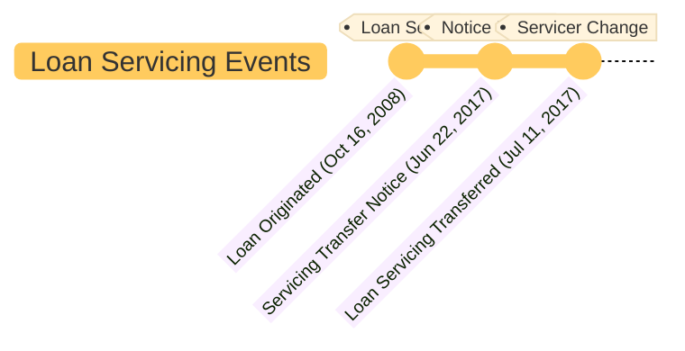

```folder-overview
id: dcc89ed9-5546-401c-a092-2b006bda3753
folderPath: ""
title: "{{folderName}} overview"
showTitle: true
depth: 4
style: list
includeTypes:
  - folder
  - all
disableFileTag: true
sortBy: name
sortByAsc: true
showEmptyFolders: false
onlyIncludeSubfolders: false
storeFolderCondition: true
showFolderNotes: true
disableCollapseIcon: true
```

# Exhibit: Bank of America Proof Documentation

---

## Summary

### Document Title
**Bank of America Proof Documentation**

### Jurisdiction Details
- **Property Location**: 1515 21st Avenue, Lewiston, ID 83501
- **Lender Details**: Bank of America, N.A.  
  - **Address**: 100 N. Tryon St., Charlotte, NC 28255-0001
  - **Servicer Transition Date**: July 11, 2017
- **New Servicer**: Carrington Mortgage Services LLC  
  - **Address**: P.O. Box 5001, Westfield, IN 46074  

---

## Key Parties Involved

### Borrower
- **Name**: Jeremy L. Bass
  - **Address**: 1515 21st Avenue, Lewiston, ID 83501

### Lender
- **Name**: Bank of America, N.A.
  - **Role**: Originator and initial servicer of the loan.

### Trustee
- **Name**: Fidelity National Title Insurance Co.
  - **Address**: P.O. Box 32695, Phoenix, AZ 85064

### New Loan Servicer
- **Name**: Carrington Mortgage Services LLC
  - **Customer Service**: 800-561-4567 (Monday–Friday, 8:00 AM to 8:00 PM EST)

---

## Document Highlights

### Loan Details
- **Loan Amount**: $146,418.00
- **Loan Origination Date**: October 16, 2008
- **Interest Rate**: 6.375% fixed
- **Maturity Date**: October 1, 2038

### Transfer Details
- Bank of America transferred loan servicing rights to Carrington Mortgage Services LLC on July 11, 2017.  
- **Notice Date**: June 22, 2017
- **Servicing Transfer Explanation**: Transition did not affect loan terms but included a change in payment address and billing.

---

## Supporting Documents Included
1. **Promissory Note**: Outlines the borrower's repayment obligations.
2. **Deed of Trust**: Describes the lien against the property for securing the loan.
3. **Loan History Statement**: Transaction details including payments, escrow activity, and servicing expenses.
4. **Service Release Notice**: Notification of servicing transfer.
5. **Communication Records**: Response to inquiries from Consumer Financial Protection Bureau (CFPB).

---

## Timeline of Events

1. ## Key Issues Noted
    
    1. **Servicing Transfer Concerns**:
        
        - Loan servicer's inability to access records in Nez Perce County, requiring the borrower to retrieve title details directly.
        - Confusion in maintaining payment records during the transition.
    2. **Loan History Review**:
        
        - Payment discrepancies noted in escrow allocations and late charges.
    3. **Customer Experience**:
        
        - Bank of America acknowledged lapses in meeting borrower expectations and extended apologies.
    
    ---
    
    ## Implications for Case
    
    1. **Title Chain Accessibility**:
        - Lack of access to county records by Bank of America poses challenges in validating the title chain.
    2. **Accuracy of Records**:
        - Loan history provided could be scrutinized for discrepancies or errors in payment postings.
    3. **Servicer Communication**:
        - Correspondence indicates acknowledgment of customer grievances and responsiveness to CFPB inquiries.
    
    ---
    
    ## Recommendations for Use
    
    - Leverage the loan history statement to identify inconsistencies in payments or escrow disbursements.
    - Use the Service Release Notice to establish procedural transparency or highlight deficiencies during the transfer.
    - Include borrower correspondence as evidence of active engagement and dispute resolution efforts.
    
    ---
    
    Copy code