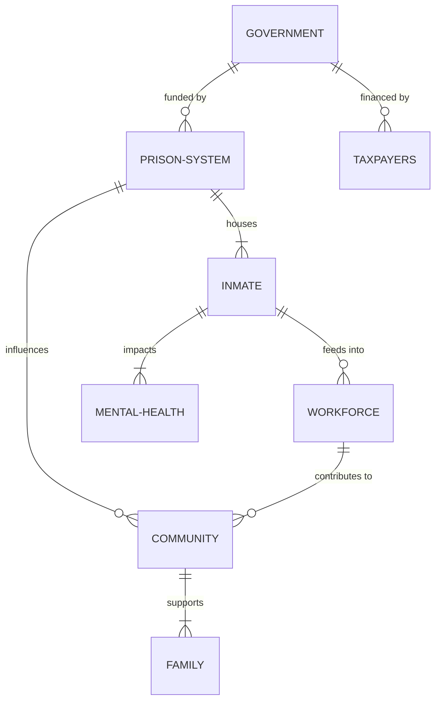
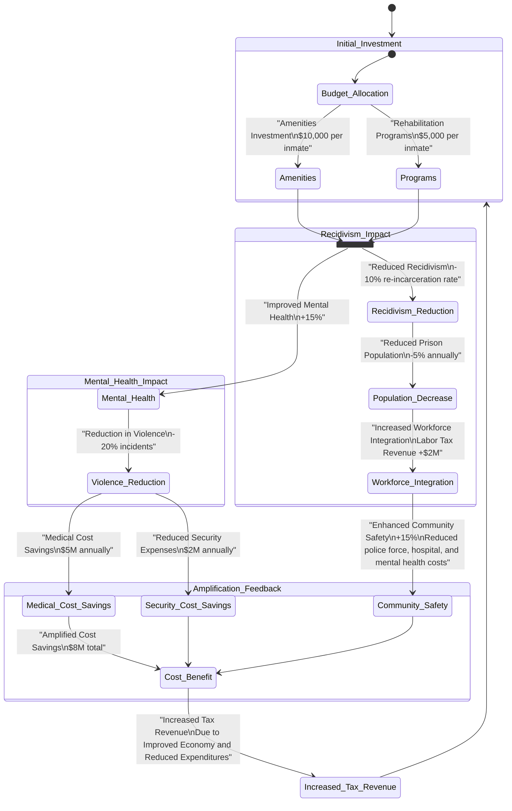
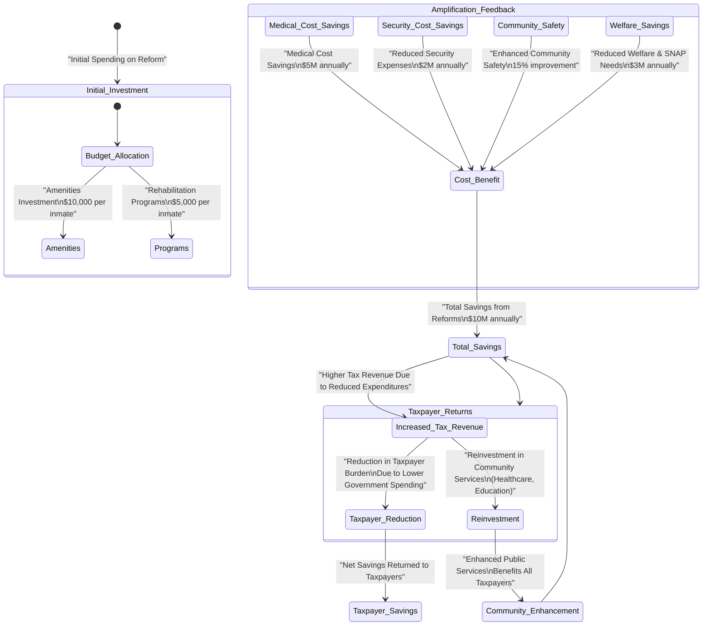
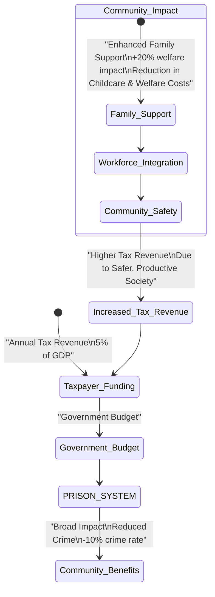
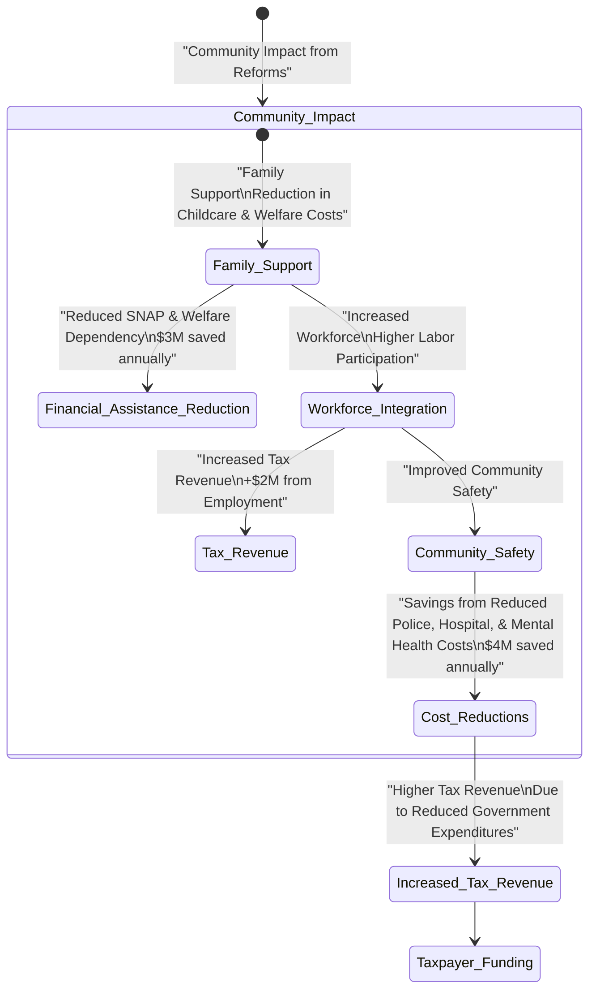

| State           | Avg. Annual Cost per Inmate | Number of Inmates | Number of Officers | Number of Support Staff | Gov. Spending on Prisons (in millions) | Cost Inclusions                                                    | Cost Exclusions                                                              |
|-----------------|-----------------------------|--------------------|--------------------|-------------------------|----------------------------------------|----------------------------------------------------------------------|------------------------------------------------------------------------------|
| Alabama         | $14,780                     | 27,000            | 6,500             | 3,000                   | $398                                   | Basic housing, food, security                                       | Comprehensive healthcare, advanced rehabilitation programs                    |
| Alaska          | $52,633                     | 5,200             | 1,200             | 700                     | $274                                   | Housing, food, security, basic healthcare                           | Specialized mental health services, extensive educational programs            |
| Arizona         | $25,397                     | 42,000            | 9,500             | 4,000                   | $1,067                                 | Housing, food, security, basic healthcare                           | Advanced vocational training, specialized medical treatments                  |
| Arkansas        | $20,915                     | 17,500            | 3,800             | 1,600                   | $366                                   | Housing, food, security                                             | Comprehensive healthcare, advanced rehabilitation programs                    |
| California      | $64,642                     | 125,000           | 34,000            | 18,000                  | $8,080                                 | Housing, food, security, healthcare, some rehabilitation programs   | Specialized mental health services, extensive educational programs            |
| Colorado        | $39,303                     | 19,000            | 4,200             | 2,100                   | $747                                   | Housing, food, security, basic healthcare                           | Advanced vocational training, specialized medical treatments                  |
| Connecticut     | $62,159                     | 13,000            | 3,100             | 1,200                   | $800                                   | Housing, food, security, healthcare, some rehabilitation programs   | Specialized mental health services, extensive educational programs            |
| Delaware        | $39,080                     | 4,500             | 1,200             | 500                     | $176                                   | Housing, food, security, basic healthcare                           | Advanced vocational training, specialized medical treatments                  |
| Florida         | $19,069                     | 94,000            | 18,500            | 10,000                  | $1,800                                 | Housing, food, security                                             | Comprehensive healthcare, advanced rehabilitation programs                    |
| Georgia         | $19,977                     | 53,000            | 12,000            | 6,500                   | $1,058                                 | Housing, food, security                                             | Comprehensive healthcare, advanced rehabilitation programs                    |
| Hawaii          | $29,425                     | 6,000             | 1,500             | 600                     | $186                                   | Housing, food, security, basic healthcare                           | Specialized mental health services, extensive educational programs            |
| Idaho           | $22,182                     | 8,500             | 2,000             | 800                     | $188                                   | Housing, food, security                                             | Comprehensive healthcare, advanced rehabilitation programs                    |
| Illinois        | $33,507                     | 39,000            | 10,000            | 5,000                   | $1,320                                 | Housing, food, security, basic healthcare                           | Advanced vocational training, specialized medical treatments                  |
| Indiana         | $18,065                     | 28,000            | 7,000             | 3,200                   | $505                                   | Housing, food, security                                             | Comprehensive healthcare, advanced rehabilitation programs                    |
| Iowa            | $37,908                     | 9,000             | 2,500             | 1,000                   | $341                                   | Housing, food, security, basic healthcare                           | Advanced vocational training, specialized medical treatments                  |
| Kansas          | $24,511                     | 10,000            | 2,600             | 1,200                   | $245                                   | Housing, food, security                                             | Comprehensive healthcare, advanced rehabilitation programs                    |
| Kentucky        | $16,681                     | 20,000            | 5,000             | 2,500                   | $334                                   | Housing, food, security                                             | Comprehensive healthcare, advanced rehabilitation programs                    |
| Louisiana       | $16,251                     | 32,000            | 8,000             | 3,800                   | $520                                   | Housing, food, security                                             | Comprehensive healthcare, advanced rehabilitation programs                    |
| Maryland        | $44,601                     | 18,000            | 4,800             | 2,200                   | $774                                   | Housing, food, security, basic healthcare                           | Advanced vocational training, specialized medical treatments                  |
| Massachusetts   | $55,170                     | 8,800             | 2,200             | 1,100                   | $485                                   | Housing, food, security, healthcare, some rehabilitation programs   | Specialized mental health services, extensive educational programs            |
| Michigan        | $35,809                     | 39,000            | 11,000            | 5,500                   | $1,400                                 | Housing, food, security, basic healthcare                           | Advanced vocational training, specialized medical treatments                  |
| Minnesota       | $41,366                     | 9,300             | 2,600             | 1,100                   | $385                                   | Housing, food, security, basic healthcare                           | Advanced vocational training, specialized medical treatments                  |
| Missouri        | $22,187                     | 27,500            | 6,800             | 3,200                   | $610                                   | Housing, food, security                                             | Comprehensive healthcare, advanced rehabilitation programs                    |
| Montana         | $33,578                     | 3,800             | 1,000             | 400                     | $127                                   | Housing, food, security, basic healthcare                           | Advanced vocational training, specialized medical treatments                  |
| Nevada          | $17,851                     | 14,000            | 3,200             | 1,800                   | $250                                   | Housing, food, security                                             | Comprehensive healthcare, advanced rehabilitation programs                    |
| New Jersey      | $61,603                     | 18,000            | 5,200             | 2,600                   | $1,100                                 | Housing, food, security, healthcare, some rehabilitation programs   | Specialized mental health services, extensive educational programs            |
| New Mexico      | $36,832                     | 6,500             | 1,800             | 800                     | $240                                   | Housing, food, security, basic healthcare                           | Advanced vocational training, specialized medical treatments                  |
| New York        | $69,355                     | 50,000            | 14,000            | 7,500                   | $3,467                                 | Housing, food, security, healthcare, some rehabilitation programs   | Specialized mental health services, extensive educational programs            |
| North Carolina  | $30,180                     | 33,000            | 8,500             | 4,200                   | $995                                   | Housing, food, security, basic healthcare                           | Advanced vocational training, specialized medical treatments                  |
| North Dakota    | $38,601                     | 1,800             | 500               | 300                     | $75                                    | Housing, food, security, basic healthcare                           | Advanced vocational training, specialized medical treatments                  |
| Ohio            | $26,509                     | 49,000            | 12,500            | 6,000                   | $1,300                                 | Housing, food, security, basic healthcare                           | Advanced vocational training, specialized medical treatments                  |
| Oklahoma        | $16,497                     | 27,000            | 7,000             | 3,000                   | $450                                   | Housing, food, security                                             | Comprehensive healthcare, advanced rehabilitation programs                    |
| Oregon          | $44,021                     | 15,500            | 4,200             | 2,000                   | $682                                   | Housing, food, security, basic healthcare                           | Advanced vocational training, specialized medical treatments                  |
| Pennsylvania    | $42,727                     | 47,000            | 13,000            | 6,500                   | $2,010                                 | Housing, food, security, basic healthcare                           | Advanced vocational training, specialized medical treatments                  |
| Rhode Island    | $58,564                     | 3,200             | 800               | 400                     | $187                                   | Housing, food, security, healthcare, some rehabilitation programs   | Specialized mental health services, extensive educational programs            |
| South Carolina  | $20,053                     | 20,000            | 5,200             | 2,500                   | $410                                   | Housing, food, security                                             | Comprehensive healthcare, advanced rehabilitation programs                    |
| South Dakota    | $20,748                     | 4,000             | 1,100             | 500                     | $90                                    | Housing, food, security                                             | Comprehensive healthcare, advanced rehabilitation programs                    |
| Tennessee       | $23,468                     | 26,500            | 6,800             | 3,300                   | $620                                   | Housing, food, security                                             | Comprehensive healthcare, advanced rehabilitation programs                    |
| Texas           | $22,012                     | 154,000           | 38,000            | 20,000                  | $3,500                                 | Housing, food, security                                             | Comprehensive healthcare, advanced rehabilitation programs                    |
| Utah            | $22,119                     | 6,700             | 1,900             | 800                     | $148                                   | Housing, food, security                                             | Comprehensive healthcare, advanced rehabilitation programs                    |
| Vermont         | $57,615                     | 1,700             | 500               | 300                     | $98                                    | Housing, food, security, healthcare, some rehabilitation programs   | Specialized mental health services, extensive educational programs            |
| Virginia        | $21,299                     | 37,000            | 10,000            | 5,000                   | $790                                   | Housing, food, security                                             | Comprehensive healthcare, advanced rehabilitation programs                    |
| Washington      | $37,841                     | 18,500            | 5,000             | 2,300                   | $700                                   | Housing, food, security, basic healthcare                           | Advanced vocational training, specialized medical treatments                  |
| West Virginia   | $27,458                     | 7,500             | 2,000             | 900                     | $205                                   | Housing, food, security                                             | Comprehensive healthcare, advanced rehabilitation programs                    |
| Wisconsin       | $38,644                     | 24,500            | 6,500             | 3,000                   | $948                                   | Housing, food, security, basic healthcare                           | Advanced vocational training, specialized medical treatments                  |
