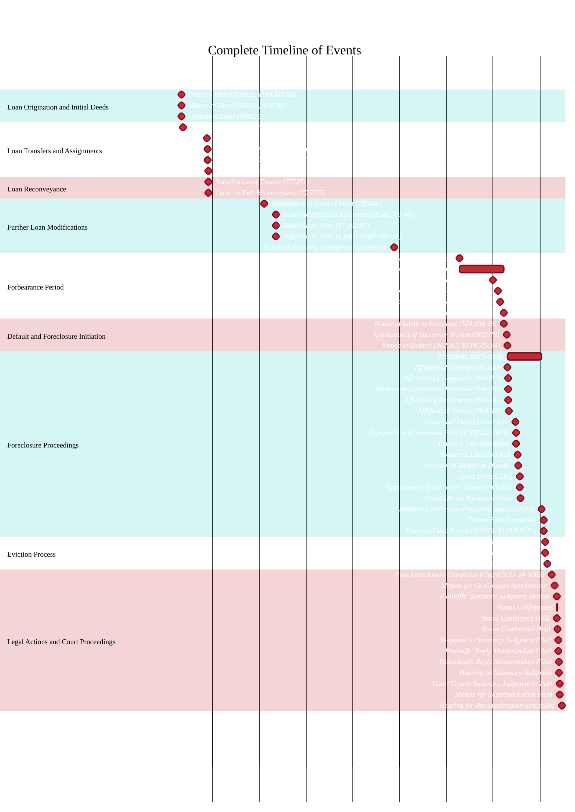
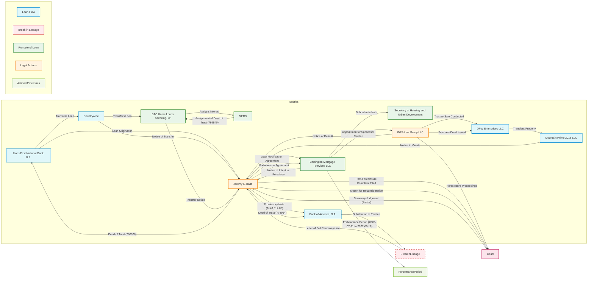
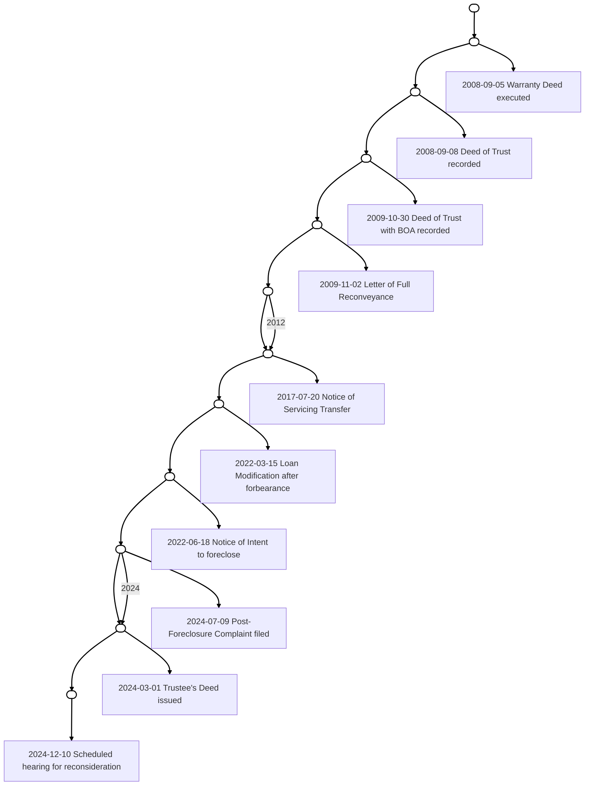

```mermaid
timeline
    title Timeline of Events

    %% Section: 2008
    section 2008
    2008-09-04 : Deed of Trust executed for ZFNB loan at 6.375%
    2008-09-05 : Warranty Deed executed; RPT transfers property to JLB with full warranty
    2008-09-05 : Quitclaim Deed executed; AMB releases all interest to JLB
    2008-09-08 : Warranty Deed recorded
    2008-09-08 : Quitclaim Deed recorded
    2008-09-08 : Deed of Trust recorded for ZFNB loan
    2008-10-01 : Notice of Transfer from ZFNB to CW of $146,418.00 at 6.375%
    2008-11-01 : Other Date associated with Notice of Transfer

    %% Section: 2009
    section 2009
    2009-10-01 : Transfer notice from CW to BAC
    2009-10-16 : Promissory Note to BOA for $148,614.00 at 5.000% (unrecorded)
    2009-10-23 : Deed of Trust notarizing date
    2009-10-30 : Deed of Trust with BOA recorded at 5.000%
    2009-11-02 : Substitution of Trustee recorded; transfer on Instrument 760926
    2009-11-02 : Letter of Full Reconveyance recorded; loan satisfied under Instrument 760926
    2009-11-03 : Transfer notice from BOA to BAC

    %% Section: 2012
    section 2012
    2012-03-20 : Assignment of Deed of Trust; MERS to BOA transferring interests on Instrument 774964
    2012-03-30 : Assignment of Deed of Trust recorded
    2012-09-14 : Loan Modification Agreement provided by CMS (unrecorded)
    2012-09-14 : Subordinate Note provided by CMS (unrecorded)
    2012-09-28 : Loan Modification Agreement date
    2012-09-28 : Subordinate Note date

    %% Section: 2017-2022
    section 2017-2022
    2017-07-20 : Notice of Servicing Transfer from BOA to Carrington
    2019-11-00 : CMS sent loan packets backdated to 2012-09-01
    2020-07-31 : COVID-19 Forbearance Letter; forbearance started
    2021-07-01 : COVID-19 Forbearance legal end date
    2022-03-15 : Loan Modification for $143,90.38 after forbearance
    2022-04-26 : Forbearance plan end date pushed to 2022-05-31
    2022-06-18 : Forbearance plan ended
    2022-06-18 : Notice of Intent to foreclose issued for $24,650.38
    2022-08-02 : Appointment of Successor Trustee recorded on Instrument 902078
    2022-08-09 : Notice of Default on Instrument 774964 for $112,136.62 plus additional amounts
    2022-08-17 : Notice of Default date
    2022-08-19 : Affidavit of Compliance with IC 45-1506C recorded
    2022-08-23 : Affidavit of Compliance recorded under Instrument 774964
    2022-08-24 : Affidavit of Publication recorded
    2022-08-31 : Affidavit of Service recorded by Sheriff
    2022-11-16 : Multiple affidavits recorded (Instruments 904186 - 904190)
    2022-12-12 : Cease and Desist letter sent to IDEA Law Group and Michael J. Newell
    2022-12-27 : Complaint and Summons filed (CV35-22-1875)
    2022-12-30 : First scheduled Trustee's Sale (auction)

    %% Section: 2023
    section 2023
    2023-01-03 : Affidavit of Mailing & Notice of Postponed Trustee's Sale recorded
    2023-01-17 : Motion to Dismiss and Strike filed by MJN
    2023-01-26 : Hearing on Motion to Dismiss
    2023-01-30 : Affidavit of Mailing & Notice of Postponed Trustee's Sale recorded
    2023-02-17 : Court denies Temporary Restraining Order
    2023-02-23 : Appointment of Successor Trustee recorded (Instrument 906092)
    2023-02-28 : Lease entered into between DP and JLB
    2023-03-09 : Court denies Reconsideration

    %% Section: 2024
    section 2024
    2024-01-29 : Affidavit of Mailing confirming postponed Trustee's Sale
    2024-02-29 : Trustee's Sale conducted; DPW and MP "purchase" property
    2024-03-01 : Trustee's Deed issued to DPW and MP from Instrument 774964
    2024-03-04 : Trustee's Deed recording date
    2024-03-21 : Notice to Vacate sent to JLB and tenant DP
    2024-03-25 : Notice to Vacate received by JLB and DP
    2024-05-02 : Follow-up email sent to authorities
    2024-07-09 : Plaintiffs file a Post-Foreclosure Complaint for Ejectment and Restitution of Property
    2024-08-13 : JLB files a Motion for Appointment of Co-Counsel
    2024-09-16 : Plaintiffs file Motion for Summary Judgment
    2024-09-17 : Status Conference held by Judge MME
    2024-10-08 : Status Conference held by Judge MME
    2024-10-15 : JLB submits Response to Plaintiffs' Motion for Summary Judgment
    2024-10-18 : Plaintiffs file Reply Memorandum in support of Motion for Summary Judgment
    2024-10-21 : JLB files Reply Memorandum in response to Plaintiffs' Reply
    2024-10-22 : Hearing for Motion for Summary Judgment
    2024-11-05 : Court grants summary judgment in part against JLB but denies against DP
    2024-11-06 : JLB files Motion for Reconsideration and Motion for Stay
    2024-12-10 : Scheduled hearing for reconsideration of the case

```

```mermaid
flowchart TD
    %% Define styles for clarity
    classDef entityStyle fill:#f0f0f0,stroke:#333,stroke-width:1px,font-size:12px;
    classDef loanStyle fill:#d0f0fd,stroke:#0077b6,stroke-width:2px;
    classDef breakStyle fill:#fde2e4,stroke:#d00000,stroke-width:2px;
    classDef legalStyle fill:#fff4e6,stroke:#f48c06,stroke-width:2px;
    classDef remakeStyle fill:#d8f3dc,stroke:#40916c,stroke-width:2px;
    classDef actionStyle fill:#eae2b7,stroke:#dda15e,stroke-width:2px;
    classDef courtStyle fill:#e9ecef,stroke:#495057,stroke-width:2px;
    classDef highlightStyle stroke:#ff006e,stroke-width:3px;

    %% Entities
    subgraph Entities
        direction TB
        ZFNB[Zions First National Bank N.A.]:::entityStyle
        CW[Countrywide]:::entityStyle
        BAC[BAC Home Loans Servicing, LP]:::entityStyle
        BoA[Bank of America, N.A.]:::entityStyle
        CMS[Carrington Mortgage Services LLC]:::entityStyle
        MERS[MERS]:::entityStyle
        JLB[Jeremy L. Bass]:::entityStyle
        AMB[Aimee M. Bass]:::entityStyle
        SoHUD[Secretary of Housing and Urban Development]:::entityStyle
        IDEA[IDEA Law Group LLC]:::entityStyle
        DPW[DPW Enterprises LLC]:::entityStyle
        MP[Mountain Prime 2018 LLC]:::entityStyle
        Court[Court]:::courtStyle
    end

    %% Loan Origination (2008-09-04)
    JLB -->|Deed of Trust<br>(760926, $148,418.00)| ZFNB:::loanStyle
    ZFNB -->|Funds Loan<br>($148,418.00)| JLB:::loanStyle

    %% Transfer to Countrywide (2008-10-01)
    ZFNB -.->|Transfers Loan| CW:::loanStyle
    CW -->|Notice of Transfer| JLB

    %% Transfer to BAC (2009-10-01)
    CW -.->|Transfers Loan| BAC:::loanStyle
    BAC -->|Transfer Notice| JLB

    %% Promissory Note to BoA (2009-10-16)
    JLB -->|Promissory Note<br>($148,614.00)| BoA:::loanStyle
    JLB -->|Deed of Trust<br>(774964)| BoA:::loanStyle

    %% Break in Loan Lineage (2009-11-02)
    BoA -->|Substitution of Trustee<br>(775251)| BreakPoint[Break in Loan Lineage]:::breakStyle
    BoA -->|Letter of Full Reconveyance<br>(775252)| JLB:::breakStyle

    %% Assignment to MERS (2012-03-20)
    BAC -.->|Assignment of Deed of Trust<br>(799540)| MERS:::remakeStyle
    MERS -.->|Holds Interest| BAC

    %% Loan Modification with CMS (2012-09-14)
    JLB -->|Loan Modification<br>Agreement ($142,709.46)| CMS:::remakeStyle
    JLB -->|Subordinate Note<br>($7,392.91)| SoHUD:::remakeStyle

    %% Forbearance Period (2020-07-31 to 2022-06-18)
    JLB -->|Requests Forbearance| CMS
    CMS -->|Forbearance Granted<br>(23 Months)| JLB:::actionStyle

    %% Default and Foreclosure Initiation (2022-06-18)
    CMS -->|Notice of Intent to Foreclose<br>($24,650.38)| JLB:::legalStyle
    CMS -->|Appoints Successor Trustee<br>(902078)| IDEA:::legalStyle

    %% Foreclosure Proceedings
    IDEA -->|Notice of Default<br>(902262, $139,529.94)| JLB:::legalStyle
    JLB -->|Cease and Desist Letter<br>(2022-12-12)| IDEA:::legalStyle
    JLB -->|Files Complaint<br>(CV35-22-1875)| Court:::legalStyle
    Court -->|Denies TRO<br>(2023-02-17)| JLB
    IDEA -->|Schedules Trustee's Sale<br>(2022-12-30)| JLB:::legalStyle
    IDEA -->|Postpones Trustee's Sale| JLB:::legalStyle
    IDEA -->|Trustee Sale Conducted<br>(2024-02-29)| DPW:::loanStyle
    IDEA -->|Issues Trustee's Deed<br>(912874)| DPW:::loanStyle
    DPW -->|Transfers Property| MP

    %% Eviction Process
    MP -->|Notice to Vacate<br>(2024-03-21)| JLB:::legalStyle

    %% Post-Foreclosure Legal Actions
    JLB -->|Files Post-Foreclosure Complaint<br>(CV35-24-1063)| Court:::legalStyle
    Court -->|Grants Partial Summary Judgment<br>(2024-11-05)| JLB
    JLB -->|Files Motion for Reconsideration<br>(2024-11-06)| Court

    %% Connections and Flow
    class BreakPoint breakStyle
    style BreakPoint stroke-dasharray: 5 5

    %% Highlights
    class JLB,BoA highlightStyle

    %% Legends
    subgraph Legends [ ]
        direction LR
        LoanFlow[Loan Transactions]:::loanStyle
        BreakLineage[Break in Lineage]:::breakStyle
        RemakeLoan[Remake of Loan]:::remakeStyle
        LegalActions[Legal Actions]:::legalStyle
        Actions[Processes/Actions]:::actionStyle
        CourtEntity[Court]:::courtStyle
    end

```

```mermaid
timeline TB:
    title Complete Timeline of Events

    section Loan Origination and Initial Deeds
    2008-09 : Deed of Trust (760926, $148,418.00)
    2008-09 : Warranty Deed (760924, $10.00)
    2008-09 : Quitclaim Deed (760925)

    section Loan Transfers and Assignments
    2008-10 : Notice of Transfer ($146,418.00)
    2009-10 : Transfer Notice (CW to BAC)
    2009-10 : Promissory Note to BoA ($148,614.00)
    2009-10 : Deed of Trust (774964, $148,614.00)
    2009-11 : Substitution of Trustee (775251)
    2009-11 : Letter of Full Reconveyance (775252)
    2009-11 : Transfer Notice (BoA to BAC)

    section Further Loan Modifications
    2012-03 : Assignment of Deed of Trust (799540)
    2012-09 : Loan Modification Agreement ($142,709.46)
    2012-09 : Subordinate Note ($7,392.91)
    2012-09 : Subordinate Note to SoHUD ($7,392.91)
    2017-10 : Notice of Servicing Transfer to Carrington
    2019-12 : New Loan Packet Sent

    section Forbearance Period
    2020-07 : Forbearance Initiated
    2020-07 - 2022-06 : Forbearance Period (23 Months)
    2022-01 : Forbearance Legal End
    2022-03 : Loan Modification Offered ($14,390.38)
    2022-04 : Forbearance Extended to 23 Months
    2022-06 : Forbearance End Letter

    section Default and Foreclosure Initiation
    2022-06 : Notice of Intent to Foreclose ($24,650.38)
    2022-08 : Appointment of Successor Trustee (902078)
    2022-08 : Notice of Default (902262, $139,529.94)

    section Foreclosure Proceedings
    2022-08 - 2024-01 : Affidavits and Notices
    2022-08 : Affidavit of Mailing (904186)
    2022-08 : Affidavit of Compliance (904187)
    2022-08 : Affidavit of Compliance Recorded (904188)
    2022-08 : Affidavit of Publication (904190)
    2022-08 : Affidavit of Service (904189)
    2022-12 : Cease and Desist Letter Sent
    2022-12 : Complaint and Summons Filed (CV35-22-1875)
    2022-12 : Trustee's Sale Scheduled
    2023-01 : Motion to Dismiss Filed
    2023-01 : Hearing on Motion to Dismiss
    2023-02 : Court Denies TRO
    2023-02 : Appointment of Successor Trustee (906092)
    2023-03 : Court Denies Reconsideration
    2024-01 : Affidavit Confirming Postponed Sale (912340)
    2024-02 : Trustee Sale Conducted ($165,346.71)
    2024-03 : Trustee's Deed Issued (912874)

    section Eviction Process
    2024-03 : Notice to Vacate Sent
    2024-03 : Notice to Vacate Received
    2024-05 : Follow-up Email to Authorities

    section Legal Actions and Court Proceedings
    2024-07 : Post-Foreclosure Complaint Filed (CV35-24-1063)
    2024-08 : Motion for Co-Counsel Appointment
    2024-09 : Plaintiffs' Summary Judgment Motion
    2024-09 : Status Conference Held
    2024-10 : Status Conference Held
    2024-10 : Response to Summary Judgment Filed
    2024-10 : Plaintiffs' Reply Memorandum Filed
    2024-10 : Defendant's Reply Memorandum Filed
    2024-10 : Hearing on Summary Judgment
    2024-11 : Court Grants Summary Judgment in Part
    2024-11 : Motion for Reconsideration Filed
    2024-12 : Hearing for Reconsideration Scheduled

```









