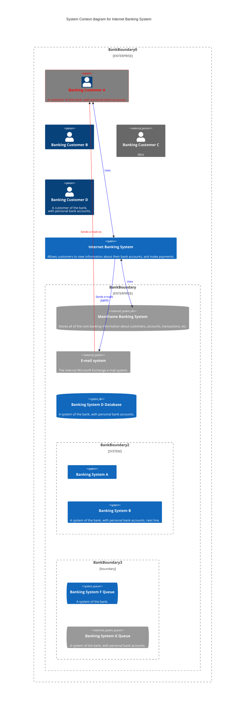

[[KELLY NICHOLAS HEITZ, INC. (Utah - 4858667-0142)]]
[[KELLY NICHOLAS HEITZ INC. (Utah - 7558223-0142)]]

# Person Overview - HEITZ, KELLY

## General Data

| Companies                            | Positions          |
|--------------------------------------|-------------------|
| [[MOUNTAIN PRIME LLC (Illinois - LLC_05154839)]]       | manager           |
| [[MPH1, LLC (Illinois - 05211824)]]                 | member            |
| [[CROSS COUNTRY EQUITY, LLC (Utah - 9591953-0160)]]     | manager           |
| [[MOUNTAIN PRIME 2017 LLC BRANCH (Minnesota - cfaaa8a5-1402-e811-9155-00155d0d6f70)]]  | manager           |
| [[ALL SEASONS REAL ESTATE LLC (Utah - 7053375-0160)]]| member, registered agent, agent            |

## Address

| Address Associated                                      |
|-----------------------------------------------|
| [[3138 N 1250 W, PLEASANT VIEW, UT, 84414-1665]]      |

## Other Associated Officers

| Name            | Position          |
|-----------------|-------------------|
| [[MUELLER, NATHAN W]]   | manager           |
| [[CAREY, PATRICK]]   | agent             |
| [[MUELLER, NATHAN W]]  | registered agent  |
| [[GLEESON, ABE J]]   | agent             |

## Last Updated

| Date          |
|---------------|
| 2022-11-11    |

#### other
| KELLY N HEITZ     | Principal | [[ALL SEASONS REAL ESTATE LLC (Utah - 7053375-0160)]] |     |
| --------------- | --------- | --------------------------- | --- |
| Ogden, Utah, US |           |                             |     |
| Location: [[1341 E 2925 N, OGDEN, UT, 84414-1821]]                |           |                             |     |