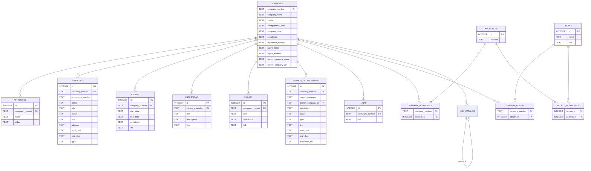

```mermaid
erDiagram
    COMPANIES {
        TEXT company_number PK
        TEXT company_name
        TEXT status
        TEXT incorporation_date
        TEXT company_type
        TEXT jurisdiction
        TEXT registered_address
        TEXT agent_name
        TEXT agent_address
        TEXT parent_company_name
        TEXT parent_company_url
    }
    ATTRIBUTES {
        INTEGER id PK
        TEXT company_number FK
        TEXT name
        TEXT value
    }
    OFFICERS {
        INTEGER id PK
        TEXT company_number FK
        TEXT occurrence_number
        TEXT name
        TEXT role
        TEXT status
        TEXT link
        TEXT address
        TEXT start_date
        TEXT end_date
        TEXT type
    }
    EVENTS {
        INTEGER id PK
        TEXT company_number FK
        TEXT start_date
        TEXT end_date
        TEXT description
        TEXT link
    }
    ASSERTIONS {
        INTEGER id PK
        TEXT company_number FK
        TEXT title
        TEXT description
        TEXT link
    }
    FILINGS {
        INTEGER id PK
        TEXT company_number FK
        TEXT date
        TEXT description
        TEXT link
    }
    BRANCH_RELATIONSHIPS {
        INTEGER id PK
        TEXT company_number FK
        TEXT branch_company
        TEXT branch_company_id FK
        TEXT jurisdiction
        TEXT status
        TEXT type
        TEXT link
        TEXT start_date
        TEXT end_date
        TEXT statement_link
    }
    LINKS {
        INTEGER id PK
        TEXT company_number FK
        TEXT link
    }
    ADDRESSES {
        INTEGER id PK
        TEXT address
    }
    PEOPLE {
        INTEGER id PK
        TEXT name
        TEXT role
    }
    COMPANY_ADDRESSES {
        TEXT company_number FK
        INTEGER address_id FK
    }
    COMPANY_PEOPLE {
        TEXT company_number FK
        INTEGER person_id FK
    }
    PEOPLE_ADDRESSES {
        INTEGER person_id FK
        INTEGER address_id FK
    }
    %% URL_CATALOG {
    %%     INTEGER id PK
    %%     TEXT url UNIQUE
    %%     TEXT html_content
    %%     BOOLEAN completed DEFAULT FALSE
    %%     INTEGER parent_id FK
    %%     TEXT company_number FK
    %% }

    COMPANIES ||--o{ ATTRIBUTES: ""
    COMPANIES ||--o{ OFFICERS: ""
    COMPANIES ||--o{ EVENTS: ""
    COMPANIES ||--o{ ASSERTIONS: ""
    COMPANIES ||--o{ FILINGS: ""
    COMPANIES ||--o{ BRANCH_RELATIONSHIPS: ""
    COMPANIES ||--o{ LINKS: ""
    COMPANIES ||--o{ COMPANY_ADDRESSES: ""
    COMPANIES ||--o{ COMPANY_PEOPLE: ""
    ADDRESSES ||--o{ COMPANY_ADDRESSES: ""
    ADDRESSES ||--o{ PEOPLE_ADDRESSES: ""
    PEOPLE ||--o{ COMPANY_PEOPLE: ""
    PEOPLE ||--o{ PEOPLE_ADDRESSES: ""
    URL_CATALOG ||--o| URL_CATALOG: parent_id
    COMPANIES ||--o{ URL_CATALOG: ""


```
