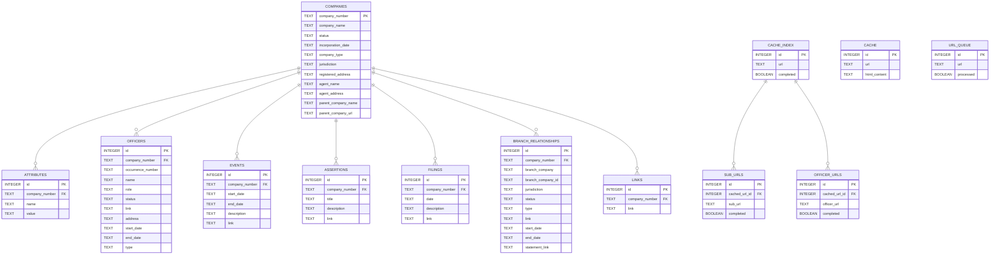

```mermaid
erDiagram
    COMPANIES {
        TEXT company_number PK
        TEXT company_name
        TEXT status
        TEXT incorporation_date
        TEXT company_type
        TEXT jurisdiction
        TEXT registered_address
        TEXT agent_name
        TEXT agent_address
        TEXT parent_company_name
        TEXT parent_company_url
    }
    ATTRIBUTES {
        INTEGER id PK
        TEXT company_number FK
        TEXT name
        TEXT value
    }
    OFFICERS {
        INTEGER id PK
        TEXT company_number FK
        TEXT occurrence_number
        TEXT name
        TEXT role
        TEXT status
        TEXT link
        TEXT address
        TEXT start_date
        TEXT end_date
        TEXT type
    }
    EVENTS {
        INTEGER id PK
        TEXT company_number FK
        TEXT start_date
        TEXT end_date
        TEXT description
        TEXT link
    }
    ASSERTIONS {
        INTEGER id PK
        TEXT company_number FK
        TEXT title
        TEXT description
        TEXT link
    }
    FILINGS {
        INTEGER id PK
        TEXT company_number FK
        TEXT date
        TEXT description
        TEXT link
    }
    BRANCH_RELATIONSHIPS {
        INTEGER id PK
        TEXT company_number FK
        TEXT branch_company
        TEXT branch_company_id
        TEXT jurisdiction
        TEXT status
        TEXT type
        TEXT link
        TEXT start_date
        TEXT end_date
        TEXT statement_link
    }
    LINKS {
        INTEGER id PK
        TEXT company_number FK
        TEXT link
    }
    CACHE_INDEX {
        INTEGER id PK
        TEXT url
        BOOLEAN completed
    }
    SUB_URLS {
        INTEGER id PK
        INTEGER cached_url_id FK
        TEXT sub_url
        BOOLEAN completed
    }
    OFFICER_URLS {
        INTEGER id PK
        INTEGER cached_url_id FK
        TEXT officer_url
        BOOLEAN completed
    }
    CACHE {
        INTEGER id PK
        TEXT url
        TEXT html_content
    }
    URL_QUEUE {
        INTEGER id PK
        TEXT url
        BOOLEAN processed
    }

    COMPANIES ||--o{ ATTRIBUTES: ""
    COMPANIES ||--o{ OFFICERS: ""
    COMPANIES ||--o{ EVENTS: ""
    COMPANIES ||--o{ ASSERTIONS: ""
    COMPANIES ||--o{ FILINGS: ""
    COMPANIES ||--o{ BRANCH_RELATIONSHIPS: ""
    COMPANIES ||--o{ LINKS: ""
    CACHE_INDEX ||--o{ SUB_URLS: ""
    CACHE_INDEX ||--o{ OFFICER_URLS: ""


```